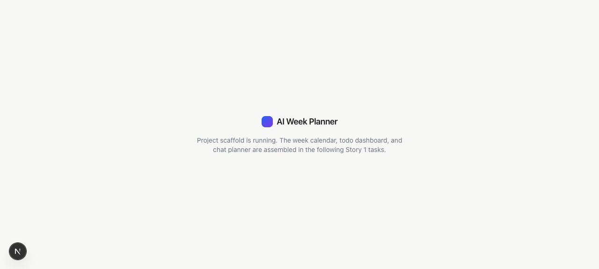

# Task 01 Proofs — Project Scaffold & AI-Native Repository Foundation

## Task Summary

This task proves the repository is a working Next.js (App Router) + TypeScript +
Tailwind v4 app that boots cleanly, has all quality gates wired and passing, and carries
the AI-native foundation (README, `AGENTS.md` + `CLAUDE.md` symlink, `docs/` steering,
Husky pre-commit hook, Vitest + React Testing Library) that every later Story 1 task
builds on.

## What This Task Proves

- The app builds and boots with `npm run dev` and serves a clean page with no console
  errors.
- `npm run lint`, `npm run typecheck`, and `npm test` all pass.
- The AI-native foundation exists: `CLAUDE.md` is a symlink to `AGENTS.md`, and `docs/`
  contains the steering docs.
- The Husky pre-commit hook actually blocks a commit when a check fails.

## Evidence Summary

- Dev server reports `✓ Ready` and `GET / 200`; the page renders the "AI Week Planner"
  brand; the browser console shows only React DevTools/HMR info (no errors).
- All three quality gates exit 0.
- `readlink CLAUDE.md` → `AGENTS.md`.
- A deliberate type error caused the pre-commit hook to fail the commit (exit 1).

## Artifact: Clean dev boot

**What it proves:** The scaffolded app compiles and serves over HTTP with no runtime
errors.

**Why it matters:** A clean boot is the baseline every subsequent surface depends on.

**Commands:**

```bash
npm run dev            # background
curl -s -o /dev/null -w "HTTP %{http_code}\n" http://localhost:3000/
```

**Result summary:** Dev server ready in ~255ms; homepage returns HTTP 200 and contains
the brand text.

```
✓ Ready in 255ms
GET / 200 in 1137ms
HTTP 200
=== page contains brand? ===
AI Week Planner
```

## Artifact: Scaffold screenshot (clean console)

**What it proves:** The page renders with Tailwind styling applied and no console errors.

**Why it matters:** Confirms Tailwind v4 CSS-first tokens work and the React tree mounts
cleanly.

**Artifact path:** `01-task-01-boot.png`

**Result summary:** The brand wordmark (blue→purple gradient chip + "AI Week Planner")
and placeholder copy render on the calm surface background. Console output was limited to
the React DevTools notice and `[HMR] connected` — no errors or warnings.



## Artifact: Quality gates pass

**What it proves:** Lint, type check, and tests all pass on the scaffold.

**Why it matters:** These are the gates the pre-commit hook enforces on every commit.

**Command:**

```bash
npm run lint && npm run typecheck && npm test
```

**Result summary:** ESLint reports no problems; `tsc --noEmit` is clean; Vitest runs the
example `Brand` test — `Test Files 1 passed (1) · Tests 1 passed (1)`.

```
> eslint .
(no output — no problems)

> tsc --noEmit
(no output — no errors)

> vitest run
 Test Files  1 passed (1)
      Tests  1 passed (1)
```

## Artifact: AI-native foundation (symlink + docs)

**What it proves:** `CLAUDE.md` resolves to `AGENTS.md`, and the steering docs exist.

**Why it matters:** Any agent/engineer opening the repo lands on a single source of
truth.

**Commands:**

```bash
readlink CLAUDE.md
ls docs
```

**Result summary:** `CLAUDE.md → AGENTS.md`; `docs/` holds `product-vision.md`,
`architecture.md`, `conventions.md` (plus `specs/`).

```
AGENTS.md
architecture.md   conventions.md   product-vision.md   specs
```

## Artifact: Pre-commit hook blocks bad code

**What it proves:** The Husky pre-commit hook runs the gates and aborts a commit on
failure.

**Why it matters:** Broken code cannot be committed, protecting `main` from regressions.

**Command:**

```bash
printf 'export const broken: number = "not a number";\n' > _hooktest.ts
git add -A && git commit -m "chore: this commit should be blocked by pre-commit"
```

**Result summary:** The commit exited with code 1 — typecheck caught the error and husky
failed the pre-commit script. (The temporary file was then removed.)

```
> tsc --noEmit
_hooktest.ts(1,14): error TS2322: Type 'string' is not assignable to type 'number'.
husky - pre-commit script failed (code 2)
git commit exit code: 1
```

## Reviewer Conclusion

The repository is a clean, buildable Next.js + TypeScript + Tailwind v4 app with passing
lint/typecheck/test gates, a working pre-commit hook, and the full AI-native
documentation foundation. Story 1's feature surfaces can now be built on top of it.
