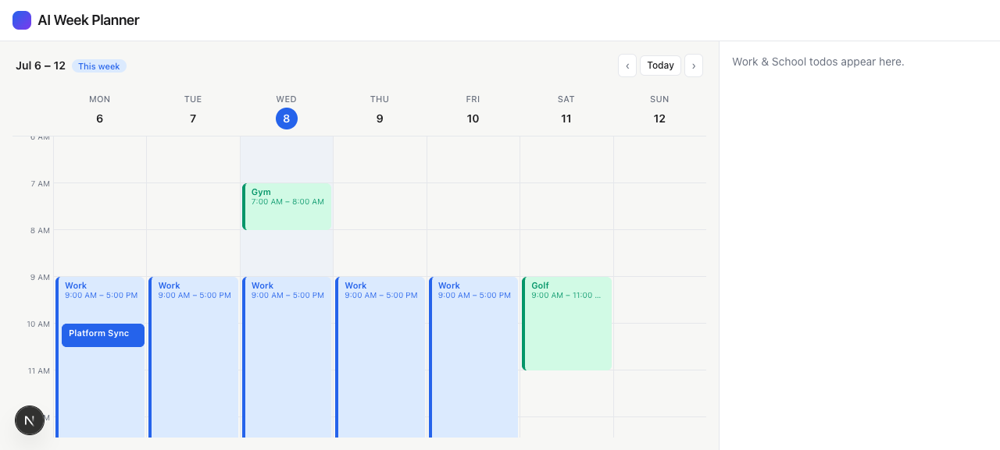
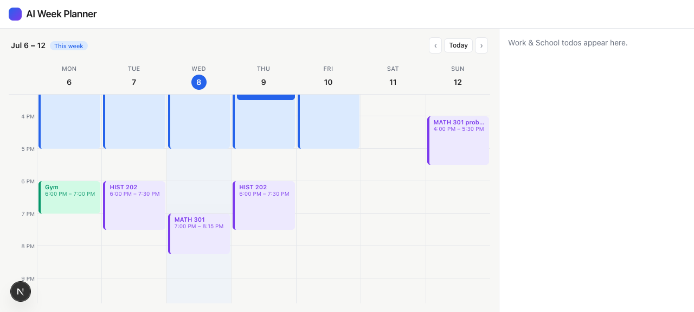

# Task 03 Proofs — Week Calendar Surface

## Task Summary

This task proves the dominant left-hand week calendar renders correctly: a Mon–Sun,
6am–10pm grid that defaults to the current week with today highlighted, supports
prev/next week navigation, draws immovable work/class blocks with meetings nested inside
the work block, colors blocks by source, and distinguishes approved (solid) from proposed
(dashed) — all driven by a single configurable, window-agnostic time window.

## What This Task Proves

- The grid shows 7 day columns (Mon–Sun) with an hour gutter (6am–10pm).
- The current week is default and **today's column is highlighted**.
- Blocks are positioned by their real times; a 9:00 AM block sits 3 hours down.
- Meetings with a `parentId` render **nested** inside the work block.
- **Color by source** works: Work = blue, School = purple, Personal = green.
- Proposed blocks use the **dashed/pending** style.
- The calendar is **window-agnostic** — a wider window re-anchors block offsets
  (the forward-compatibility constraint for Story 3).

## Evidence Summary

- `npm run lint`, `npm run typecheck`, and `npm test` all pass (38 tests, incl. calendar
  positioning/nesting/dashed/window tests).
- Live screenshots show the seeded week with today = Wed 8 highlighted, work blocks with
  a nested meeting, and evening purple class blocks — no console errors.

## Artifact: Calendar tests pass

**What it proves:** Block positioning, dashed proposed style, meeting nesting, today
highlight, and window-agnostic offsets are all verified.

**Why it matters:** These are the behaviors a screenshot alone can't guarantee across
future changes.

**Command:**

```bash
npm test
```

**Result summary:** 6 test files, 38 tests passing — including
`components/Calendar/Calendar.test.tsx` (7:00/9:00 positioning, `border-dashed` on
proposed, `data-nested="true"` on the meeting, single highlighted today column, and a
5am-start window shifting the 9:00 block from 3h to 4h down) and `lib/time.test.ts` /
`lib/week.test.ts`.

```
 Test Files  6 passed (6)
      Tests  38 passed (38)
```

## Artifact: Calendar — morning (today highlighted, nested meeting)

**What it proves:** The current week renders with today marked and a meeting nested in
the work block.

**Why it matters:** Confirms the core layout, the today highlight, and the nested-meeting
rule visually.

**Artifact path:** `01-task-03-calendar.png`

**Result summary:** "Jul 6 – 12 / This week", Wed **8** highlighted (2026-07-08 is a
Wednesday), Mon–Fri Work blocks (blue) with **Platform Sync** nested inside Monday's
block, and Gym/Golf in green.



## Artifact: Calendar — evening (all three source colors)

**What it proves:** School (purple) class blocks render alongside Work (blue) and
Personal (green), and the grid scrolls to show the full window.

**Why it matters:** Confirms the color-by-source system across all three sources.

**Artifact path:** `01-task-03-calendar-evening.png`

**Result summary:** HIST 202 (Tue/Thu) and MATH 301 (Wed) classes render in purple; the
Sunday MATH problem-set block is purple; Monday Gym is green — matching the source color
rules.



## Reviewer Conclusion

The week calendar is complete: an accurate, current, color-coded week with immovable
blocks, nested meetings, and approved/proposed distinction, built on a window-agnostic
foundation and covered by tests.
