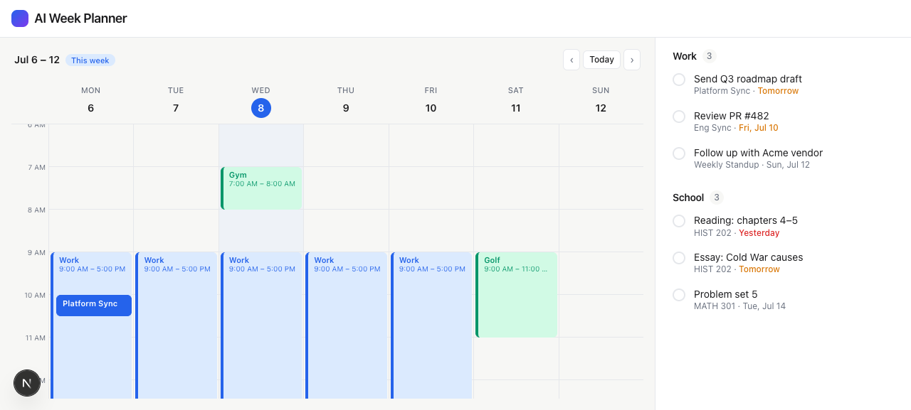
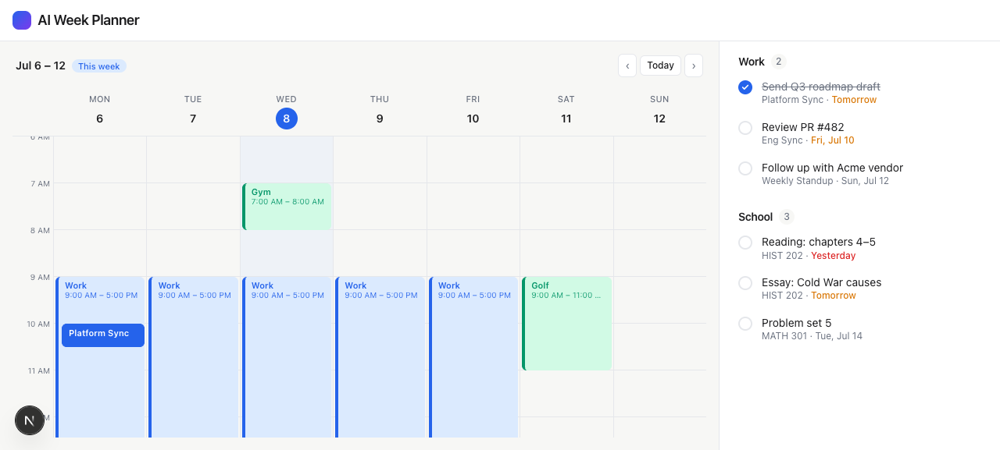

# Task 04 Proofs — Work + School Todo Dashboard

## Task Summary

This task proves the right-hand dashboard renders two Things3-style todo sections (Work
and School), each with a count badge, circular checkboxes, a title, and exactly one
metadata line that always shows a due date — with due-soon/overdue emphasis and a working
check toggle.

## What This Task Proves

- Two sections (**Work**, **School**) render with a count badge of open items.
- Each item shows a circular checkbox + title + one metadata line.
- **Work** items show `source meeting · date`; **School** items show `course · due date`.
- Every item always shows a due date; **overdue** is red, **due-soon** is amber.
- Checking an item toggles it (strikethrough + filled checkbox) and updates the badge.

## Evidence Summary

- `npm run lint`, `npm run typecheck`, `npm test` all pass (7 files, 44 tests) including
  the metadata-rules, count-badge, overdue-emphasis, and toggle tests.
- Screenshots show the seeded dashboard and a checked item with the badge decremented.

## Artifact: Todo dashboard tests pass

**What it proves:** The item metadata rules, count badge, overdue emphasis, and checkbox
toggle all behave as specified.

**Why it matters:** These encode the Things3 information design and the due-date rule.

**Command:**

```bash
npm test
```

**Result summary:** `components/TodoSection/TodoSection.test.tsx` passes — Work item shows
`Platform Sync` + `Tomorrow`; School item shows `HIST 202`; count badge shows `1` open of
2; the overdue due-label carries `text-danger` and text `overdue`; clicking a checkbox
calls `onToggle("w1")`; a done item is `aria-checked="true"`. Suite total: 44 passing.

```
 Test Files  7 passed (7)
      Tests  44 passed (44)
```

## Artifact: Dashboard rendered (Things3 style)

**What it proves:** Both sections render with badges, one-line metadata, and due-date
emphasis by color.

**Why it matters:** This is the visual + information design the spec asked for.

**Artifact path:** `01-task-04-todos.png`

**Result summary:** Work (badge 3) and School (badge 3) sections; overdue "Yesterday"
renders red, due-soon "Tomorrow"/"Fri, Jul 10" render amber, further-out dates are muted.



## Artifact: Checkbox toggle

**What it proves:** Checking an item updates its visual state and the section count.

**Why it matters:** Confirms the interactive (in-memory) toggle works end to end.

**Artifact path:** `01-task-04-todos-checked.png`

**Result summary:** "Send Q3 roadmap draft" is checked (filled circle + strikethrough) and
the Work badge dropped from **3 to 2**.



## Reviewer Conclusion

The two-section todo dashboard matches the Things3-inspired spec: count badges, circular
checkboxes, single-line metadata with an always-present, emphasis-aware due date, and a
working toggle — all covered by tests.
