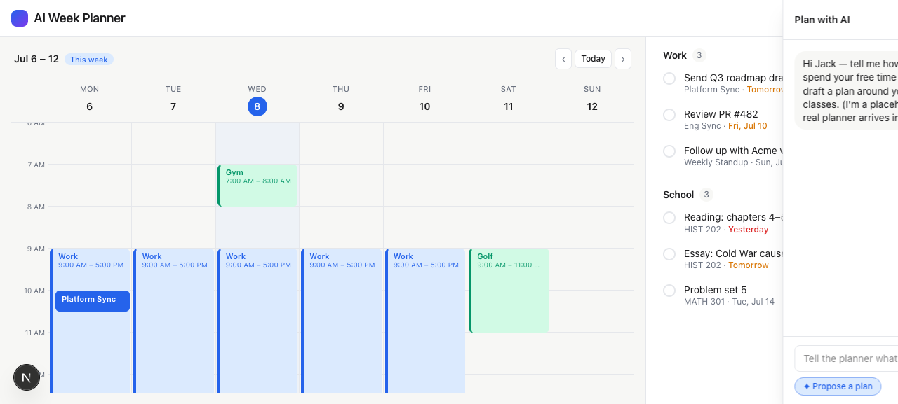
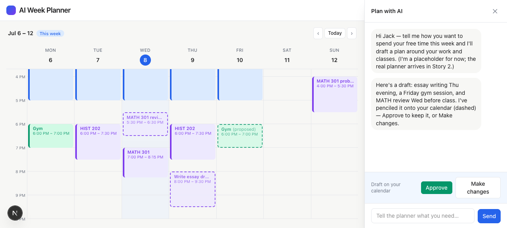
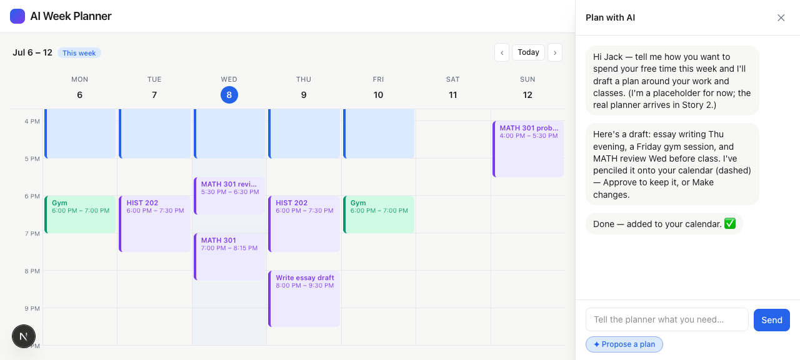

# Task 05 Proofs — Chat Bubble, Drawer & Mock Proposal Flow

## Task Summary

This task proves the chat interaction — the only way to plan. A floating bubble opens a
right slide-in drawer (sized to the todo column, calendar stays visible); messages echo a
placeholder reply; a "Propose a plan" button drops dashed pending blocks onto the
calendar with Approve / Make changes; Approve commits them to solid, Make changes discards
them without committing.

## What This Task Proves

- The chat bubble opens a right drawer that leaves the calendar visible.
- Sending a message appends the user message + a canned assistant reply (no AI).
- "Propose a plan" adds dashed/pending blocks and shows Approve / Make changes.
- **Approve** converts pending → approved (solid); **Make changes** removes them,
  committing nothing.
- No proposed block overlaps an immovable block (the mock proposal is in free space).

## Evidence Summary

- `npm run lint`, `npm run typecheck`, `npm test` all pass (9 files, 51 tests), including
  a `DashboardShell` integration test of the full propose→approve / propose→make-changes
  loop and the `ChatDrawer` contract test.
- Screenshots show the drawer open, the proposed (dashed) state, and the approved (solid)
  state; DOM checks confirm 3 proposed blocks appear then 0 remain after Approve.

## Artifact: Chat + proposal tests pass

**What it proves:** The approval logic and drawer behavior are verified end to end.

**Why it matters:** "Approval before commit" is a core rule; this asserts it at the UI
level, not just in the pure functions.

**Command:**

```bash
npm test
```

**Result summary:** `DashboardShell.test.tsx` — proposing adds 3 pending blocks; Approve
leaves 0 pending and marks a previously-proposed block `approved`; Make changes leaves 0
pending and removes the blocks entirely. `ChatDrawer.test.tsx` — renders history, Send
calls `onSend`, Approve/Make changes call their callbacks, and the action bar only shows
when a proposal is pending. Suite total: 51 passing.

```
 Test Files  9 passed (9)
      Tests  51 passed (51)
```

## Artifact: Drawer open (calendar stays visible)

**What it proves:** The bubble opens a right drawer covering the todo column while the
calendar remains fully visible.

**Artifact path:** `01-task-05-chat-open.png`

**Result summary:** "Plan with AI" drawer with the welcome message, composer, and
"✦ Propose a plan"; the week calendar is unobstructed on the left.



## Artifact: Proposal pending (dashed blocks + action bar)

**What it proves:** Proposing shows dashed pending blocks on the calendar and the Approve
/ Make changes bar in the drawer.

**Artifact path:** `01-task-05-proposed.png`

**Result summary:** Three dashed "(proposed)" blocks appear in free space — MATH 301
review (Wed), Gym (Fri), Write essay draft (Thu) — none overlapping work/class; the drawer
shows the summary message and "Approve / Make changes". A DOM check counted exactly 3
`[data-status="proposed"]` blocks.



## Artifact: Approved (committed to solid)

**What it proves:** Approve converts the pending blocks to committed (solid) ones.

**Artifact path:** `01-task-05-approved.png`

**Result summary:** The same three blocks are now solid (no dashed border, no "(proposed)"
label); chat shows "Done — added to your calendar. ✅". A DOM check found 0
`[data-status="proposed"]` remaining.



## Reviewer Conclusion

The chat-driven proposal loop works as designed and enforces approval-before-commit:
proposals are visible-but-pending on the calendar, Approve commits them, and Make changes
discards them — all verified by an integration test and screenshots.
