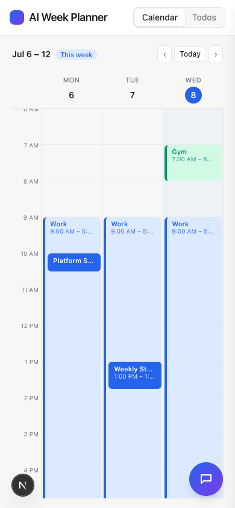
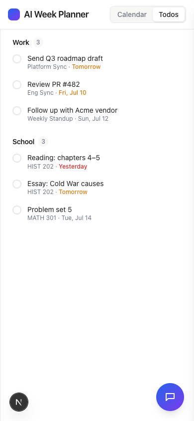
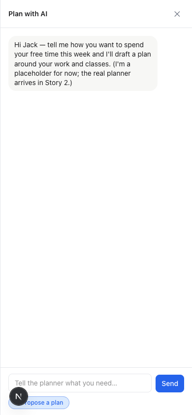
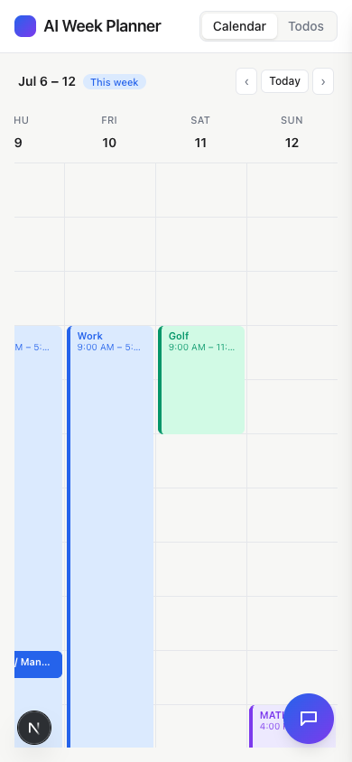
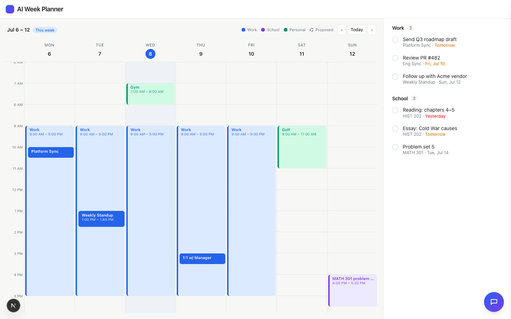

# Task 06 Proofs — Responsive/Mobile Layout, Legend & Polish

## Task Summary

This task proves the app is usable on a phone (top Calendar | Todos toggle, horizontally
scrollable week, full-screen chat drawer), shows a small color legend on desktop, meets
accessibility basics, and remains clean and production-buildable.

## What This Task Proves

- On a phone width, a top **Calendar | Todos** toggle switches the main view.
- The week calendar scrolls **horizontally** so day columns stay readable.
- The chat drawer is **full-screen** on mobile.
- A small **color legend** appears on wide screens.
- Interactive controls are keyboard-activatable with accessible names.
- `npm run build` succeeds and all gates pass.

## Evidence Summary

- `npm run lint`, `npm run typecheck`, `npm test` pass (10 files, 55 tests, incl. the a11y
  test) and `npm run build` compiles successfully.
- Screenshots at 390px show the toggle, the two mobile views, full-screen chat, and a
  horizontally-scrolled week; a 1440px shot shows the legend + full dashboard.

## Artifact: Build + tests + a11y

**What it proves:** The story is production-buildable and accessibility basics are tested.

**Commands:**

```bash
npm run lint && npm run typecheck && npm test
npm run build
```

**Result summary:** 55 tests pass including `components/accessibility.test.tsx` (todo
checkbox has an accessible name and is Enter-activatable; chat buttons + composer expose
names; the bubble has a descriptive label; the legend is labeled and uses text, not color
alone). `next build` reports "Compiled successfully" and prerenders `/`.

```
 Test Files  10 passed (10)
      Tests  55 passed (55)

▲ Next.js 16.2.10
✓ Compiled successfully
Route (app)  ○ /   (Static)
```

## Artifact: Mobile — Calendar view (toggle + readable week)

**Artifact path:** `01-task-06-mobile-calendar.png`

**Result summary:** At 390px the header shows the **Calendar | Todos** toggle (Calendar
active); the week renders with readable day columns (Mon–Wed visible, more via horizontal
scroll); the chat bubble floats bottom-right.



## Artifact: Mobile — Todos view

**Artifact path:** `01-task-06-mobile-todos.png`

**Result summary:** Toggling to **Todos** shows the full-width Work + School sections with
badges and due dates.



## Artifact: Mobile — full-screen chat

**Artifact path:** `01-task-06-mobile-chat.png`

**Result summary:** The chat drawer covers the whole phone screen with header, messages,
composer, and "Propose a plan".



## Artifact: Mobile — horizontal scroll to the weekend

**Artifact path:** `01-task-06-mobile-scroll.png`

**Result summary:** Scrolling the week horizontally reveals Thu–Sun (Fri Work, Sat Golf,
Sun MATH block) while keeping columns readable.



## Artifact: Desktop — legend + full dashboard

**Artifact path:** `01-task-06-desktop-legend.png`

**Result summary:** At 1440px the calendar controls show the color legend (Work / School
/ Personal / Proposed); the full week (nested meetings, all three colors), the Work +
School todo column, and the chat bubble are all visible.



## Reviewer Conclusion

The dashboard is responsive (mobile toggle, horizontal-scroll week, full-screen chat),
carries a color legend, meets accessibility basics, and builds cleanly for production —
completing the Story 1 UI shell.
