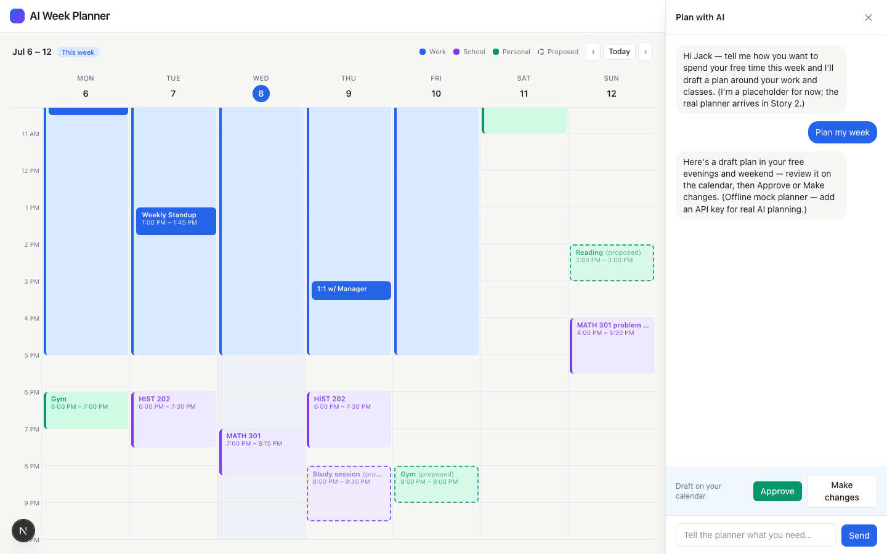
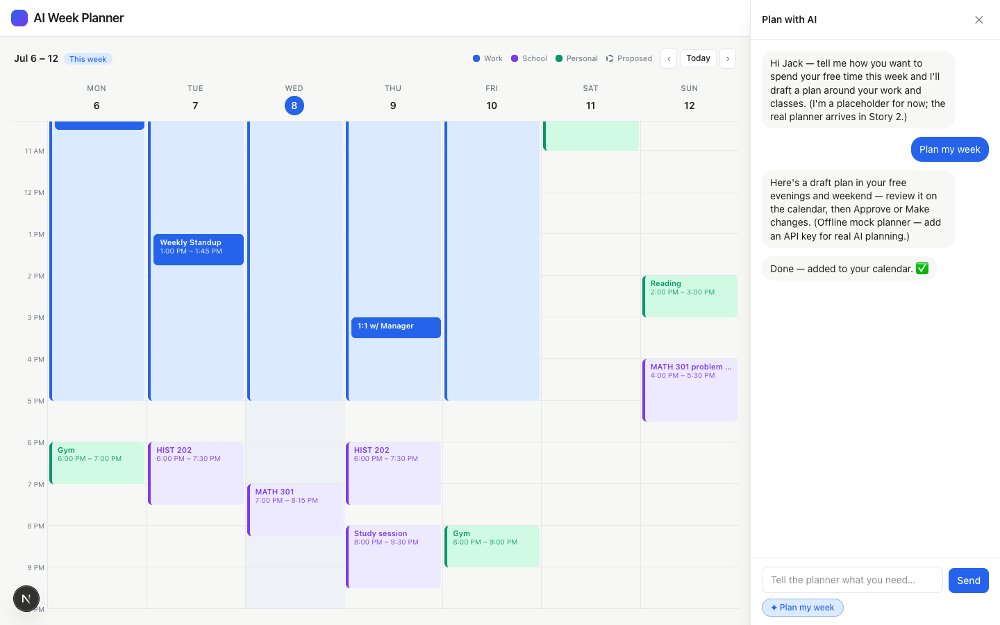

# Task 03 Proofs — Chat Wired to the Planner

## Task Summary

This task proves the chat now drives the real planner endpoint: a message calls
`/api/plan`, a thinking indicator shows while awaiting, the assistant reply renders, and
a returned proposal appears as dashed blocks with Approve / Make changes — reusing the
Story 1 approve/discard logic. Errors surface gracefully without changing the calendar.

## What This Task Proves

- Sending a message (or the "Plan my week" quick action) POSTs `week` + `messages` to
  `/api/plan` and renders the assistant reply.
- A returned proposal shows as dashed proposed blocks on the calendar.
- Approve commits them (dashed → solid); Make changes discards them.
- A failed request shows a friendly message and leaves blocks unchanged.

## Evidence Summary

- `components/DashboardShell.test.tsx` (fetch mocked) passes: request shape, reply,
  proposed blocks, Approve commits, Make changes discards, and the error path — suite =
  69 tests.
- Live screenshots (mock planner) show the wired proposal and the approved result.

## Artifact: Wired-flow integration test

**What it proves:** The UI calls the endpoint and drives the full loop against a mocked
`fetch`, including the error path.

**Command:**

```bash
npm test
```

**Result summary:** `DashboardShell.test.tsx` asserts `fetch("/api/plan", {method:"POST"})`
is called with `week` + `messages`, the reply "Here's a plan." renders, one proposed
block appears, Approve leaves 0 proposed (block now `approved`), Make changes removes it,
and a non-ok response renders "couldn't reach the planner" with 0 proposed blocks. Suite:
69 passing.

## Artifact: Planner proposal on the calendar (mock planner)

**What it proves:** A real request to `/api/plan` returns a reply + proposal that renders
as dashed blocks while the calendar stays visible.

**Artifact path:** `02-task-03-proposed.png`

**Result summary:** "Plan my week" → assistant reply → three dashed "(proposed)" blocks
(Reading Sat, Study session Thu, Gym Fri) with the Approve / Make changes bar. A DOM check
counted 3 `[data-status="proposed"]` blocks.



## Artifact: Approved plan (committed to solid)

**What it proves:** Approve converts the planner's proposal to committed blocks.

**Artifact path:** `02-task-03-approved.png`

**Result summary:** The three blocks are now solid, chat shows "Done — added to your
calendar. ✅", and a DOM check found 0 `[data-status="proposed"]` remaining.



## Reviewer Conclusion

The chat is fully wired to the planner endpoint: messages produce real (mock-backed)
proposals on the calendar, and the Story 1 approval loop commits or discards them
unchanged. The error path is covered by the automated test.
