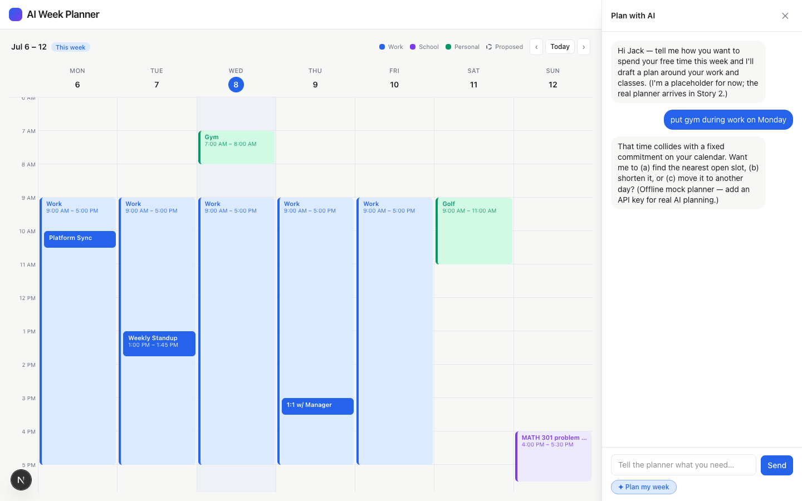
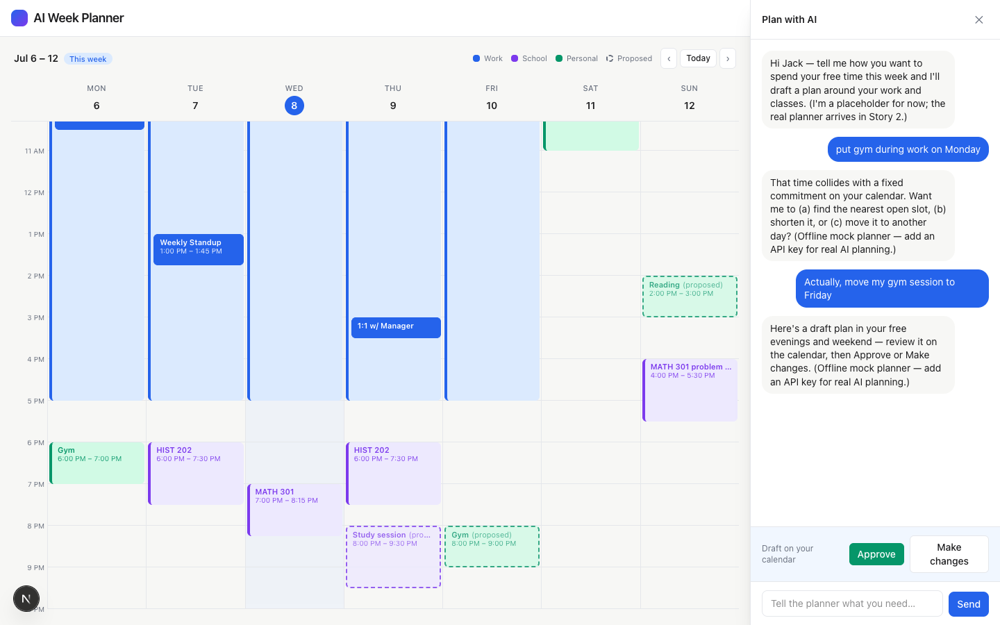

# Task 04 Proofs — Mid-week Replanning & Conflict Handling

## Task Summary

This task proves the two trust behaviors: the planner revises on request (mid-week
replanning), and it refuses to overlap an immovable block — asking how to resolve the
conflict instead. It also locks in the never-overlap guarantee with a test that survives
a deliberately bad model output.

## What This Task Proves

- A follow-up change message produces an **updated proposal** reflecting the change.
- An unfittable request yields a clarifying **reply with options and no proposed blocks**.
- The server never returns a proposal overlapping any immovable block, even when the
  (mocked) AI returns blocks over multiple immovable blocks.
- The full suite + production build pass.

## Evidence Summary

- `route.test.ts` adds a conflict case (no proposal) and a multi-block never-overlap case
  (only the free block survives) — suite = 71 tests.
- Screenshots show the conflict ask (no dashed blocks) and the replanned proposal.
- `npm run build` compiles; `/api/plan` is a server route.

## Artifact: Conflict + never-overlap tests

**What it proves:** Conflicts return no proposal, and immovable-overlapping AI blocks are
always stripped.

**Command:**

```bash
npm test
```

**Result summary:** `route.test.ts` — a "put gym during work" message (mock path) returns
`proposal: undefined` with a clarifying reply; a bad AI output with blocks over work AND
over a Tuesday class returns a proposal containing only the one free-space block. Suite:
71 passing.

## Artifact: Conflict handling (ask, don't overlap)

**What it proves:** When a request can't fit, the planner asks with options and adds no
blocks.

**Artifact path:** `02-task-04-conflict.png`

**Result summary:** "put gym during work on Monday" → the assistant replies "That time
collides with a fixed commitment … (a) find the nearest open slot, (b) shorten it, or
(c) move it to another day?" and the calendar shows **no** dashed blocks (DOM check: 0
`[data-status="proposed"]`).



## Artifact: Mid-week replanning (updated proposal)

**What it proves:** A follow-up change produces a revised proposal, with prior
conversation retained.

**Artifact path:** `02-task-04-replan.png`

**Result summary:** After the conflict exchange, "Actually, move my gym session to
Friday" produces a fresh proposal whose **Gym (proposed)** block is on Friday (day 4),
alongside the study and reading blocks — 3 dashed blocks with Approve / Make changes.



## Artifact: Production build

**Command:**

```bash
npm run build
```

**Result summary:** `✓ Compiled successfully`; the route table lists `ƒ /api/plan` (a
server route). Lint + typecheck + all 71 tests pass.

## Reviewer Conclusion

The planner is trustworthy: it revises on request, refuses to overlap immovable blocks
(asking instead), and the server strips any overlapping block regardless of model
output — all verified by tests and screenshots, with a clean production build.
