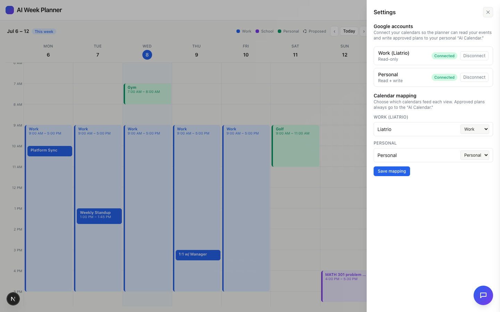

# Task 02 Proofs — Calendar mapping + auto-created "AI Calendar"

## Task Summary

This task lets the user list each connected account's calendars, assign them to work /
personal / ignored, persist that mapping, and guarantees a personal **"AI Calendar"** exists
(created if missing) as the write-back target — deliberately excluded from the planner's busy
sources so the AI never treats its own placements as busy.

## What This Task Proves

- Calendars for each connected account are listed and can be mapped in the UI.
- The mapping persists to a gitignored file and round-trips.
- Saving a mapping ensures the "AI Calendar" exists (idempotent) and records its id.
- The "AI Calendar" is excluded from the busy-source set (the ownership rule).

## Evidence Summary

- 5 unit tests pass (mapping persistence + busy-source exclusion; AI-Calendar idempotent
  create/reuse).
- Live API (demo mode): `POST /api/google/mapping` returns `aiCalendarId`, and the personal
  calendar list then includes "AI Calendar".
- Screenshot: the Settings → Calendar mapping UI with both accounts connected and per-calendar
  work/personal selects.

## Artifact: Mapping + AI-Calendar unit tests

**What it proves:** Persistence round-trips; the AI Calendar is created once and reused; and
it is excluded from busy sources.

**Why it matters:** These encode the ownership rule and safe auto-creation.

**Command:**

```bash
npx vitest run lib/google/mapping.test.ts lib/google/ensureAiCalendar.test.ts
```

**Result summary:** All pass. Key cases: "excludes the AI Calendar from personal busy
sources"; "creates the AI Calendar once and reuses its id thereafter (idempotent)"; "reuses
an existing calendar named 'AI Calendar' without creating a new one".

## Artifact: Live API — auto-creates the "AI Calendar" (demo mode)

**What it proves:** Saving a mapping creates the write-back calendar and returns its id;
the personal calendar list then contains it.

**Why it matters:** This is the end-to-end behavior a reviewer can reproduce without a
Google account (`GOOGLE_MOCK=1`).

**Command:**

```bash
GOOGLE_MOCK=1 TOKEN_ENC_SECRET=dev npm run dev   # then:
curl -s http://localhost:3000/api/google/calendars
curl -s -X POST http://localhost:3000/api/google/mapping \
  -H 'content-type: application/json' \
  -d '{"work":["work-primary"],"personal":["personal-primary"],"ignored":[]}'
curl -s http://localhost:3000/api/google/calendars
```

**Result summary:** Before mapping, personal has only "Personal". The POST returns
`aiCalendarId: "mock-cal-ai-calendar"`. After, the personal list includes "AI Calendar".

```json
// before
{"work":[{"id":"work-primary","name":"Liatrio","primary":true}],
 "personal":[{"id":"personal-primary","name":"Personal","primary":true}]}
// POST /api/google/mapping →
{"work":["work-primary"],"personal":["personal-primary"],"ignored":[],
 "aiCalendarId":"mock-cal-ai-calendar"}
// after
{"work":[...],"personal":[{"id":"personal-primary","name":"Personal","primary":true},
 {"id":"mock-cal-ai-calendar","name":"AI Calendar"}]}
```

## Artifact: Calendar-mapping UI

**What it proves:** The Settings drawer shows both accounts connected and a per-calendar
work/personal/ignore mapping with a Save action.

**Why it matters:** This is the user-facing surface for choosing calendar sources.

**Artifact path:** `docs/specs/03-spec-google-calendar-integration/03-proofs/03-task-02-mapping-ui.png`

**Result summary:** "Google accounts" shows Work (Liatrio) and Personal both **Connected**;
"Calendar mapping" shows Liatrio → Work and Personal → Personal selects with a Save button.
(The calendar behind still shows Story 1/2 mock data — real events are wired in Task 3.)



## Reviewer Conclusion

Calendar mapping works end-to-end: calendars are listed, mapped, and persisted; the "AI
Calendar" is auto-created and recorded; and it is excluded from busy sources so the AI won't
treat its own events as busy. Verified by unit tests and reproducible demo-mode API calls.
