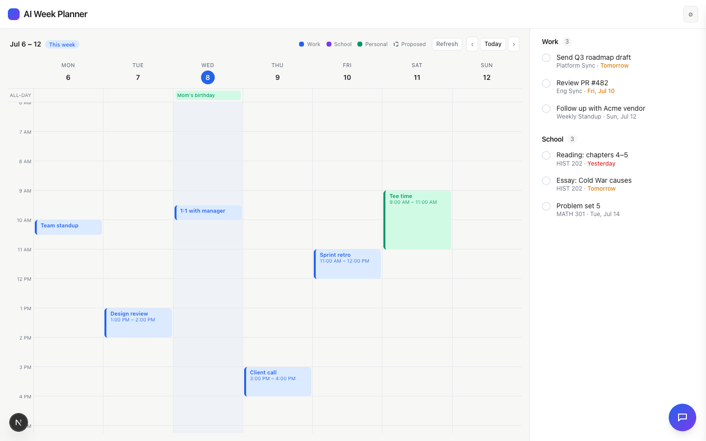
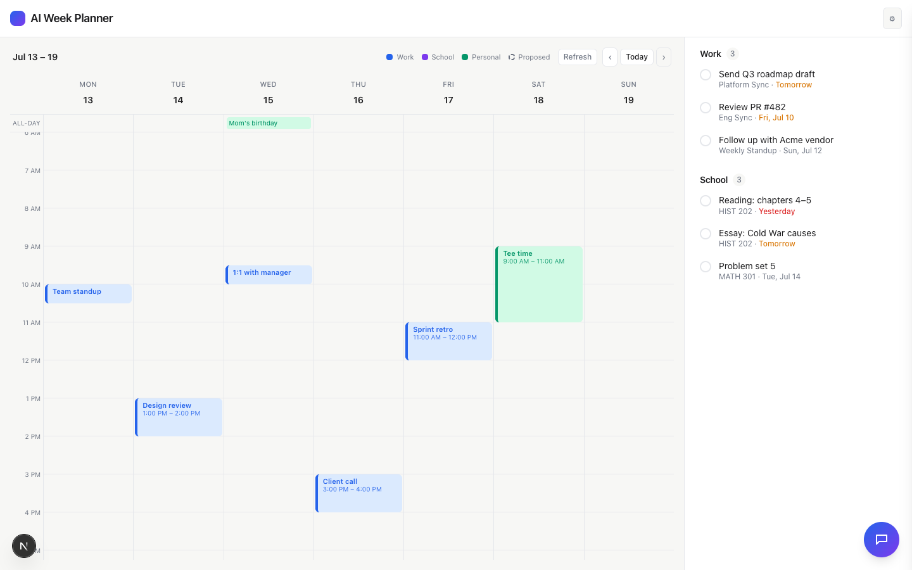
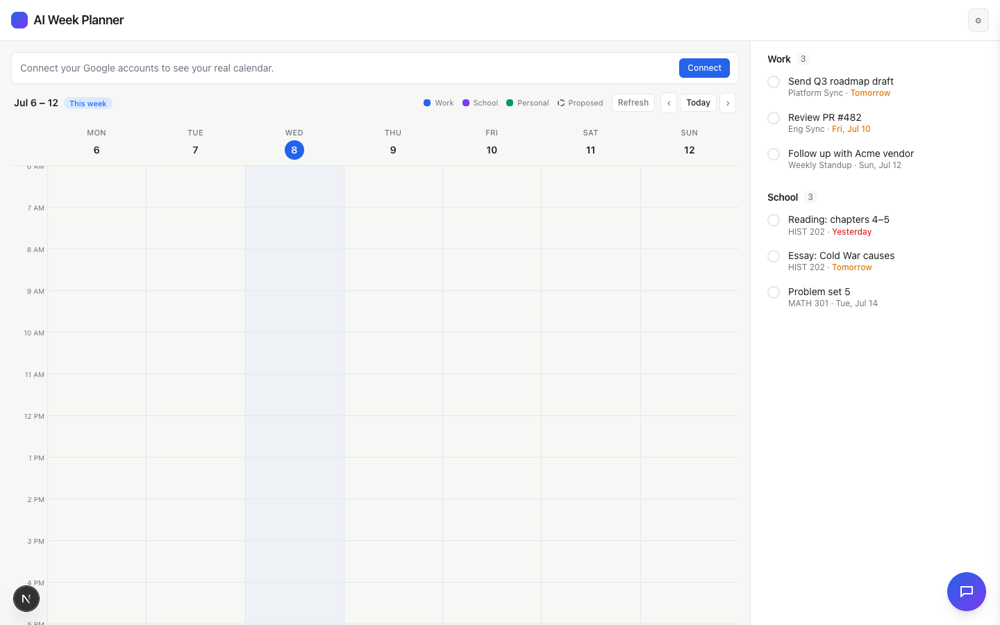

# Task 03 Proofs — Read & display real events (navigation + refresh)

## Task Summary

This task fetches events server-side for the mapped calendars over the displayed week's real
dates, transforms them into calendar blocks (work + personal, with all-day events in a thin
strip), adds prev/next week navigation + a Refresh button, auto-expands the time window for
out-of-range events, and degrades gracefully when no account is connected. Per Jack's
direction, the calendar now shows ONLY Google events (no hardcoded work-hours skeleton).

## What This Task Proves

- Real events render on their real dates for the displayed week.
- Week navigation re-fetches events for the newly displayed week.
- All-day events appear in the top strip and are not placed on the hourly grid.
- The app loads and prompts to connect when no account is configured (no crash).
- The event→block transform, week math, and window expansion are unit-tested.

## Evidence Summary

- 9 new/updated unit tests pass (event mapping, all-day classification, out-of-week drop,
  AI-source override, window expansion, day-index, real-date headers, all-day-in-strip).
- Screenshot: current week showing real work + personal events and an all-day event.
- Screenshot: next week showing that week's events (per-week fetch).
- Screenshot: disconnected state showing the connect prompt + empty calendar.

## Artifact: Event-mapping + week unit tests

**What it proves:** Google events map to the correct day/time/source; all-day events are
classified separately; out-of-week events drop; AI-written source is honored and kept
movable; the window widens for early events.

**Command:**

```bash
npx vitest run lib/google/eventMap.test.ts components/Calendar/Calendar.test.tsx
```

**Result summary:** All pass, including "maps a timed work event to the right
day/time/source and marks it immovable", "classifies an all-day event separately", "drops
events outside the displayed week", "auto-expands the window to fit an early event", and
"renders an all-day event in the top strip, not on the hourly grid".

## Artifact: Week view with real events (demo mode)

**What it proves:** Real work meetings and a personal event render on their real dates, with
an all-day event in the strip; there is no hardcoded work-hours block.

**Why it matters:** This is the core read + display outcome of Story 3.

**Artifact path:** `docs/specs/03-spec-google-calendar-integration/03-proofs/03-task-03-week-events.png`

**Result summary:** Jul 6–12 with Wed 8 highlighted as today. Work events (blue): Team
standup, Design review, 1:1 with manager, Sprint retro, Client call. Personal (green): Tee
time (Sat). All-day strip: "Mom's birthday" (Wed). Refresh + prev/next/Today controls present.



## Artifact: Week navigation (per-week fetch)

**What it proves:** Prev/next navigation shows a different week and re-fetches its events.

**Artifact path:** `docs/specs/03-spec-google-calendar-integration/03-proofs/03-task-03-next-week.png`

**Result summary:** After clicking Next, the header reads "Jul 13 – 19" (no "This week"
badge) and that week's events render.



## Artifact: Graceful disconnected state

**What it proves:** With no Google account connected, the app still loads and shows a
"Connect your Google accounts" prompt over an empty calendar — no crash.

**Why it matters:** Directly addresses the audit's graceful-degradation flag.

**Artifact path:** `docs/specs/03-spec-google-calendar-integration/03-proofs/03-task-03-connect-state.png`

**Result summary:** `GET /api/google/status` returns `{work:false,personal:false}`; the UI
shows the connect banner + Connect button and an empty week grid; todos still render.



## Reviewer Conclusion

Reading and displaying real events works end-to-end: events land on real dates for the
displayed week, navigation re-fetches per week, all-day events sit in their own strip, and
the disconnected state is handled gracefully — all verified by unit tests and reproducible
demo-mode screenshots.
