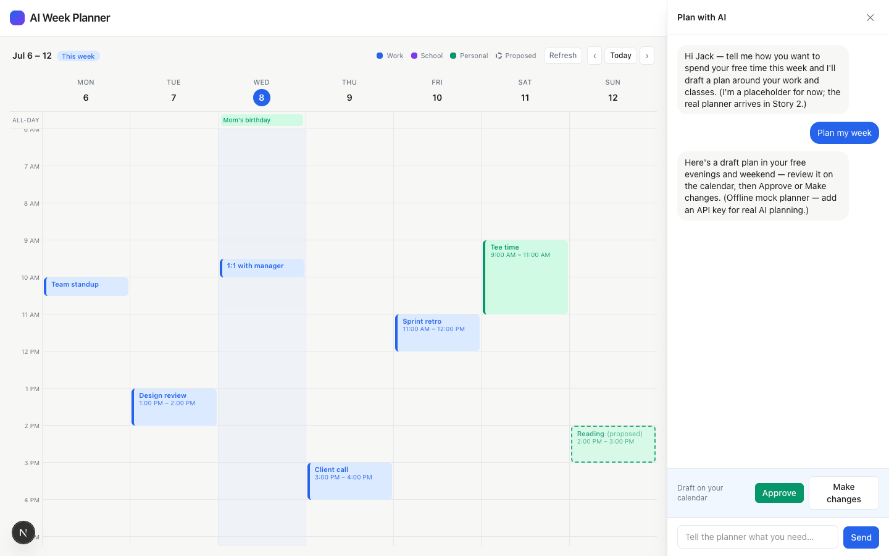
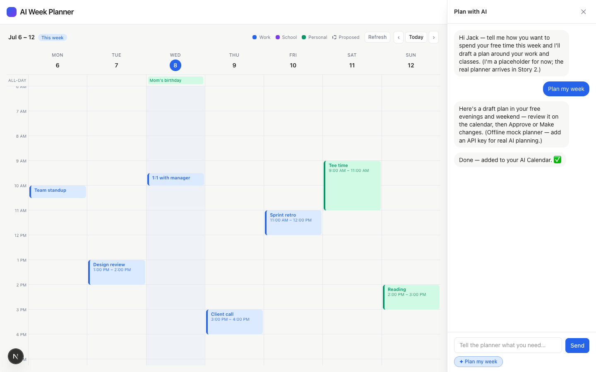

# Task 04 Proofs — Write-back to "AI Calendar" + real busy model

## Task Summary

This task closes the loop: approving a plan writes each block to the personal "AI Calendar"
as a real event (tagging its source), and the planner treats real work + personal events as
immovable busy time while excluding the AI's own "AI Calendar" events — so the tested
"never overlap" rule now holds against real data and the AI can freely re-plan its own blocks.

## What This Task Proves

- Approving writes the plan to the AI Calendar (never to a busy/read-only source) and the
  events round-trip back on re-fetch.
- The busy set = real work + personal events, and excludes AI-Calendar events.
- A proposal overlapping a real fetched event is rejected server-side (AI untrusted).
- The proposal → approve → write-back → re-render loop works end-to-end in the UI.

## Evidence Summary

- 9 targeted tests pass: busy-set membership, write-back (writes to AI Calendar with source;
  never to busy sources), and validation (rejects overlap with a real event; allows overlap
  with an AI-Calendar event).
- Live API (demo mode): `POST /api/google/commit` then `GET /api/google/events` shows the
  written block returning from the AI Calendar with `immovable: false`.
- Screenshots: a dashed proposal placed only in free space around real events, and the
  approved block rendered solid with an "added to your AI Calendar" confirmation.

## Artifact: Busy model + write-back + validation tests

**What it proves:** The ownership rule and never-overlap guarantee against real data.

**Command:**

```bash
npx vitest run lib/google/busy.test.ts lib/google/writeback.test.ts lib/planner/validate.test.ts
```

**Result summary:** 9 pass. Highlights: "includes real work + personal events and excludes
AI-Calendar events"; "ensures the AI Calendar, inserts each block there, and returns id
pairs"; "writes only to the AI Calendar, never to a busy source"; "rejects a proposal
overlapping a real (fetched) Google event"; "allows a proposal overlapping an AI-Calendar
event (not busy)".

## Artifact: Live write-back round-trip (demo mode)

**What it proves:** Approval writes to the AI Calendar and the event returns on re-read,
marked non-busy.

**Command:**

```bash
curl -s -X POST http://localhost:3000/api/google/commit -H 'content-type: application/json' \
  -d '{"blocks":[{"id":"prop-0","title":"Gym","source":"personal","status":"proposed","day":2,"startMinutes":1200,"endMinutes":1260}],"weekOffset":0}'
curl -s "http://localhost:3000/api/google/events?week=0"   # → includes Gym
```

**Result summary:** commit returns `{"committed":[{"id":"prop-0","googleEventId":"mock-evt-1"}]}`;
the events fetch then includes `{title:"Gym", immovable:false, source:"personal", calendarId:"…ai-calendar"}`.

## Artifact: Proposal placed only in free space (dashed)

**What it proves:** The planner plans around real Google events (never overlapping them).

**Artifact path:** `docs/specs/03-spec-google-calendar-integration/03-proofs/03-task-04-proposal.png`

**Result summary:** "Reading (proposed)" renders dashed on Sun 2–3pm; it and the other draft
blocks avoid the real work meetings and Tee time. Approve / Make changes are offered.



## Artifact: Approved plan written to the AI Calendar (solid)

**What it proves:** Approving converts the draft to real AI-Calendar events shown solid, with
a clear confirmation.

**Artifact path:** `docs/specs/03-spec-google-calendar-integration/03-proofs/03-task-04-approved.png`

**Result summary:** After Approve, "Reading" renders solid and the chat says "Done — added to
your AI Calendar. ✅". The events API confirms Gym / Study session / Reading now live on the
AI Calendar (`immovable: false`).



## Reviewer Conclusion

The write-back loop and real busy model work end-to-end: approvals are written only to the
"AI Calendar" (source-tagged, round-tripping on re-read), real events are immovable busy time
the AI plans around, and AI-Calendar events are excluded from busy — all verified by unit
tests and reproducible demo-mode API calls + screenshots.
