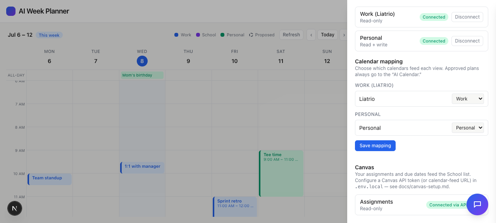

# Task 01 Proofs — Canvas connection foundation, config & status

## Task Summary

This task establishes the server-only Canvas integration foundation: a
configuration module that reads Canvas credentials from environment variables and
selects a source (API token → ICS feed → none), a status endpoint that reports
connection state without leaking the secret, a status row in the ⚙︎ Settings
drawer, and setup docs. It's the base every later task builds on.

## What This Task Proves

- Source selection follows the required precedence: **token** beats **ICS** beats
  **none**, and the token path requires both a base URL and a token.
- `GET /api/canvas/status` returns only `{ connected, mode }` — never the token or
  ICS URL.
- The ⚙︎ Settings drawer shows a Canvas status row (connected + which mode).
- Config is documented and sanitized (`.env.example` placeholders +
  `docs/canvas-setup.md`).

## Evidence Summary

- `lib/canvas/config.test.ts` (6 cases) + `app/api/canvas/status.test.ts` (3 cases)
  pass — 9 Canvas tests green; lint + typecheck clean.
- `curl /api/canvas/status` in demo mode returns `{"connected":true,"mode":"token"}`
  with no secret.
- Settings-drawer screenshot shows the Canvas row reading "Connected via API token".

## Artifact: Config + status unit tests

**What it proves:** Source-selection precedence and the no-secret-leak guarantee are
covered by automated tests.

**Why it matters:** These are the core behaviors of Unit 1; the leak test guards the
server-only boundary.

**Command:**

```bash
npx vitest run lib/canvas app/api/canvas
```

**Result summary:** 2 files, 9 tests pass (precedence matrix, mock mode, and the
status route returning only booleans without the token/URL).

```
 Test Files  2 passed (2)
      Tests  9 passed (9)
```

## Artifact: Status endpoint (no secret leak)

**What it proves:** The status route reports connection + mode without exposing the
credential.

**Why it matters:** The secret must never reach the browser; this is the observable
proof for a running server.

**Command:**

```bash
curl -s http://localhost:3000/api/canvas/status   # CANVAS_MOCK=1
```

**Result summary:** Returns `{"connected":true,"mode":"token"}` — connection state
only, no token or URL in the payload.

```json
{"connected":true,"mode":"token"}
```

## Artifact: Settings drawer — Canvas status row

**What it proves:** The Canvas connection status is surfaced in the UI alongside
Google.

**Why it matters:** This is the user-facing confirmation that Canvas is connected
and via which source, with no secret-input field (env-var config only).

**Artifact path:** `docs/specs/04-spec-canvas-assignments/04-proofs/04-task-01-settings-drawer.png`

**Result summary:** The ⚙︎ Settings drawer shows a **Canvas** section — "Assignments
· Read-only" with a green **Connected via API token** badge (demo mode).



## Reviewer Conclusion

The Canvas foundation is in place: configuration resolves the right source by
precedence, the status endpoint is safe (no secret leak, proven by test and curl),
and the connection state is visible in Settings. Ready for assignment fetching in
Task 02.
