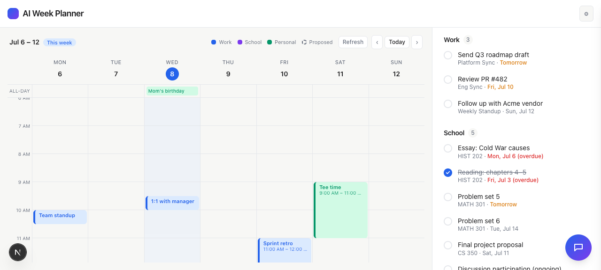
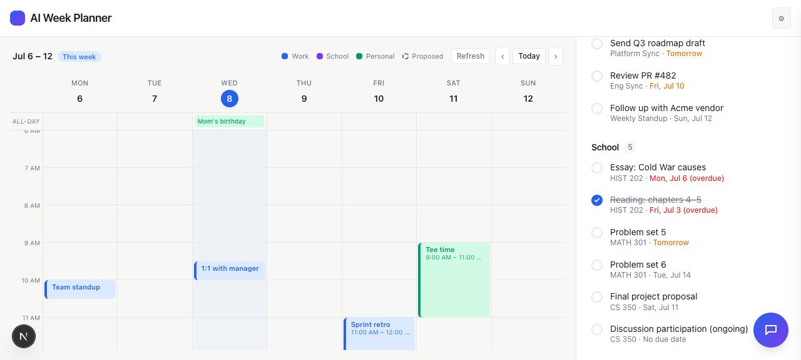
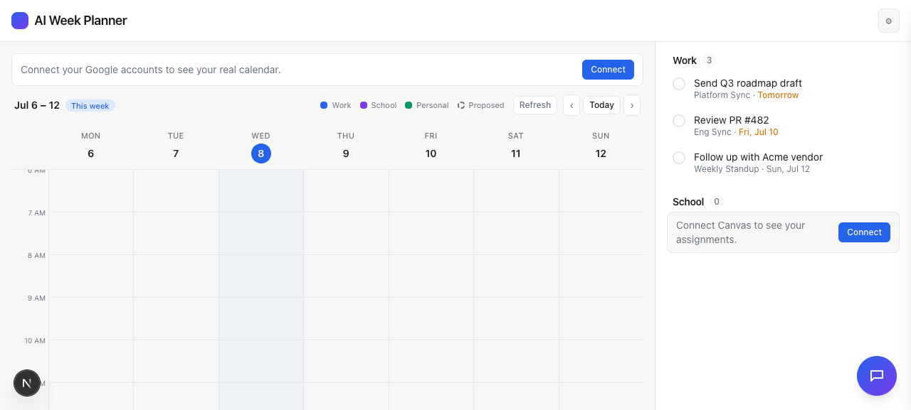

# Task 03 Proofs — Render Canvas assignments in the School section + refresh

## Task Summary

This task wires the Canvas data layer into the UI. `DashboardShell` now fetches
assignments on mount, renders them in the **School** section (Work stays mock),
shows submitted items checked-but-visible, labels undated items "No due date",
shows a "Connect Canvas" empty state when unconfigured, and re-fetches on the
existing Refresh button. The School todos also feed the planner via `allTodos`.

## What This Task Proves

- The School section is populated from `/api/canvas/assignments` (not mock data).
- Submitted assignments render checked and remain visible; undated ones show
  "No due date".
- A "Connect Canvas" empty state appears when Canvas is not connected.
- Pressing Refresh re-fetches assignments (same control as the calendar refresh).

## Evidence Summary

- `DashboardShell.canvas.test.tsx` (3 tests) passes; full suite **125 tests** green;
  lint + typecheck clean.
- Screenshot (demo mode): School shows Canvas assignments — "Reading: chapters 4–5"
  is checked & struck-through (submitted), "Essay" is overdue (red).
- Screenshot: the undated "Discussion participation (ongoing)" shows "No due date".
- Screenshot (no mock): School shows "Connect Canvas to see your assignments."

## Artifact: School-section component tests

**What it proves:** The School list is driven by the Canvas endpoints, with the
submitted/undated/empty/refresh behaviors covered automatically.

**Why it matters:** These are the user-facing FRs of Unit 2 (UI) + Unit 3 (refresh).

**Command:**

```bash
npx vitest run components/DashboardShell.canvas.test.tsx
```

**Result summary:** 3 tests pass — assignments render (submitted checked, undated
labeled), the "Connect Canvas" empty state shows when disconnected, and Refresh
re-fetches `/api/canvas/assignments`.

```
 Test Files  1 passed (1)
      Tests  3 passed (3)
```

Full suite:

```
 Test Files  28 passed (28)
      Tests  125 passed (125)
```

## Artifact: School section populated from Canvas (demo mode)

**What it proves:** Real (demo) Canvas assignments render in the School list with
correct due-date emphasis and submission state.

**Why it matters:** This is the core end-to-end result Jack asked for — assignments
appear automatically instead of being typed by hand.

**Artifact path:** `docs/specs/04-spec-canvas-assignments/04-proofs/04-task-03-school-populated.png`

**Result summary:** School shows HIST/MATH/CS assignments. "Reading: chapters 4–5"
is checked and struck-through (Canvas reports it submitted); "Essay: Cold War causes"
is flagged overdue in red. Work section is unchanged (still mock).



## Artifact: Undated assignment shows "No due date"

**What it proves:** Assignments without a due date are included and clearly labeled.

**Why it matters:** Jack explicitly asked to include undated items as checkable todos;
this required relaxing the `dueDate`-required invariant.

**Artifact path:** `docs/specs/04-spec-canvas-assignments/04-proofs/04-task-03-school-undated.png`

**Result summary:** "Discussion participation (ongoing) · CS 350 · No due date" renders
at the bottom of the School list.



## Artifact: "Connect Canvas" empty state

**What it proves:** When Canvas is not configured, the School section guides the user
to connect rather than showing a confusing empty or mock list.

**Why it matters:** Graceful not-connected UX, parallel to the Google empty state.

**Artifact path:** `docs/specs/04-spec-canvas-assignments/04-proofs/04-task-03-connect-empty-state.png`

**Result summary:** With no `CANVAS_MOCK` and no credentials, School shows "Connect
Canvas to see your assignments." with a Connect button; count is 0; Work stays mock.



## Reviewer Conclusion

The School section is now fully Canvas-driven: assignments render with correct
submission and due-date behavior, undated items are handled, the empty state is
graceful, and Refresh keeps the list current — all covered by tests and shown in the
running app.
