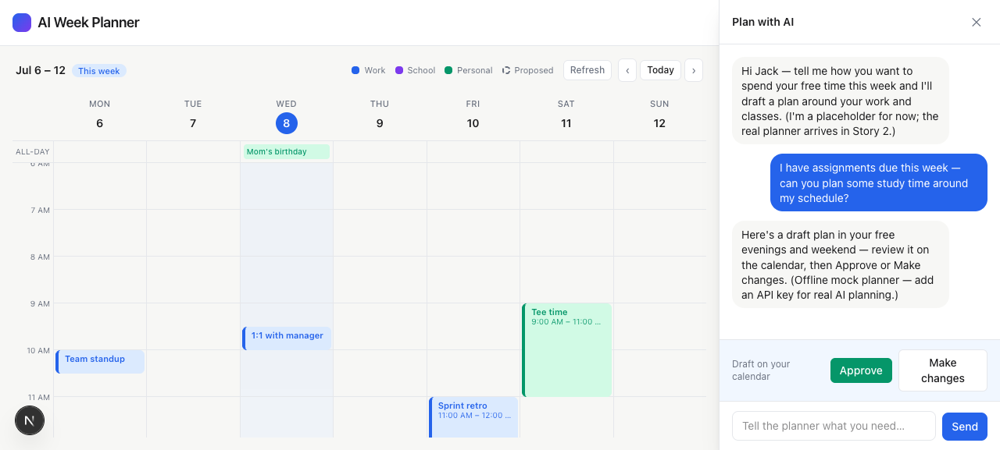

# Task 04 Proofs — Planner deadline awareness

## Task Summary

This task makes the AI treat School assignments as real deadlines. The Canvas
School todos already flow to the planner via `toWeekState` → `serializeWeek`; this
task strengthens the system prompt so the model prioritizes soonest-due and overdue
work and warns when a request would leave no time before a due date — while keeping
the Story 2 rules (never overlap immovable, propose only on request, approval
required) unchanged. It also makes `serializeWeek` render undated todos cleanly.

## What This Task Proves

- The system prompt now instructs the AI to treat School due dates as real
  deadlines, prioritize soonest-due/overdue, and warn when at risk.
- The existing core rules (immovable, propose-on-request, approval) are intact.
- Undated todos serialize as "no due date" (never "due undefined").
- Canvas School todos reach the planner and the chat→propose→approve loop works
  end-to-end.

## Evidence Summary

- `lib/planner/prompt.test.ts` gains 2 assertions; full suite **127 tests** green;
  lint + typecheck clean.
- Screenshot: the planner chat, asked to plan study time around the schedule,
  returns a draft plan with Approve / Make changes — with the Canvas School
  assignments present in context.

## Artifact: Planner prompt tests (deadline guidance + rules intact)

**What it proves:** The prompt change is present and the pre-existing rules and
serialization still hold.

**Why it matters:** The deadline-prioritization behavior lives in the prompt; the
test is the deterministic proof (it reaches a live model when `ANTHROPIC_API_KEY` is
set), and it guards against regressing the Story 2 rules.

**Command:**

```bash
npx vitest run lib/planner/prompt.test.ts
```

**Result summary:** Passes — new assertions confirm the prompt contains "deadline",
"overdue", "soonest-due" and still contains "only propose blocks when jack asks";
`serializeWeek` renders "no due date" for undated todos and never emits "undefined".

```
 Test Files  28 passed (28)
      Tests  127 passed (127)
```

## Artifact: Planner chat proposes around the schedule

**What it proves:** With Canvas School assignments in context, asking the AI to plan
study time produces a reviewable draft plan (Approve / Make changes), and approval is
still required before anything is committed.

**Why it matters:** This is the end-to-end demonstration that the planner consumes the
real School todos and follows the propose→approve loop.

**Note on the planner:** `ANTHROPIC_API_KEY` is not set, so the **offline mock
planner** answered (it says so in its reply). The mock returns a scripted draft, so it
does not itself re-order by due date — the deadline-prioritization instruction is
verified by the prompt unit test above and takes effect the moment a key is added
(zero code change, per the planner boundary). This matches how Stories 2–3 handled the
no-key state.

**Artifact path:** `docs/specs/04-spec-canvas-assignments/04-proofs/04-task-04-planner-chat.png`

**Result summary:** Jack asks "I have assignments due this week — can you plan some
study time around my schedule?"; the planner returns a draft plan and shows
"Draft on your calendar · Approve / Make changes".



## Reviewer Conclusion

The planner now treats Canvas assignment due dates as real deadlines (prompt guidance
proven by test), the Story 2 rules are preserved, undated items serialize cleanly, and
the chat→propose→approve loop works with real School todos in context. Story 4 is
functionally complete.
