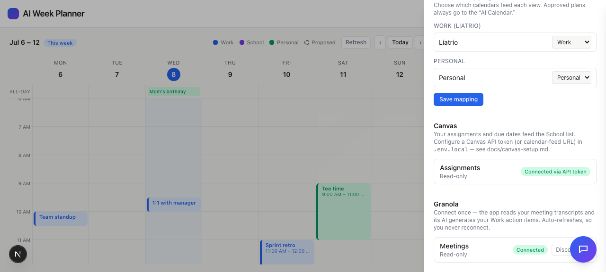

# Task 01 Proofs — Granola OAuth foundation + status

## Task Summary

Establishes the server-only Granola integration: OAuth connect/callback/disconnect
routes, an AES-256-GCM encrypted refresh-token store (so you connect once and the
app auto-refreshes forever), a status endpoint that never leaks the token, a Settings
status row, and setup docs.

## What This Task Proves

- The Granola refresh token is encrypted at rest and never stored in plaintext.
- `GET /api/granola/status` returns only `{ connected }` — never token material.
- The ⚙︎ Settings drawer shows a Granola status row (Connected + Disconnect / Connect).
- Config is documented and sanitized (`.env.example` + `.gitignore` + `docs/granola-setup.md`).

## Evidence Summary

- `tokenStore.test.ts` (2 cases) + `status.test.ts` (1 case) pass; lint + typecheck clean.
- `curl /api/granola/status` in demo mode → `{"connected":true}` with no secret.
- Settings-drawer screenshot shows Google + Canvas + Granola rows.

## Artifact: Token-store + status tests

**What it proves:** Encryption-at-rest and the no-leak status guarantee are covered.

**Why it matters:** The refresh token is sensitive; these guard the server-only boundary.

**Command:**

```bash
npx vitest run lib/granola app/api/granola
```

**Result summary:** 3 tests pass — refresh token is ciphertext on disk and decrypts
back; `status()` is boolean-only; the route never echoes the seeded token.

```
 Test Files  2 passed (2)
      Tests  3 passed (3)
```

## Artifact: Status endpoint (no secret leak)

**Command:** `curl -s http://localhost:3000/api/granola/status` (GRANOLA_MOCK=1)

**Result summary:** Returns `{"connected":true}` — connection state only.

```json
{"connected":true}
```

## Artifact: Settings drawer — Granola status row

**What it proves:** Granola connection status is surfaced in the UI beside Google/Canvas.

**Artifact path:** `docs/specs/05-spec-granola-action-items/05-proofs/05-task-01-settings-granola.png`

**Result summary:** The ⚙︎ Settings drawer shows a **Granola** section — "Meetings ·
Read-only" with a green **Connected** badge and a Disconnect control (demo mode). Copy
explains connect-once + auto-refresh.



## Reviewer Conclusion

The Granola OAuth foundation is in place and safe (encrypted token, no leak), with the
connect-once/auto-refresh model surfaced in Settings. Ready for transcript fetch + AI
extraction in Task 02.
