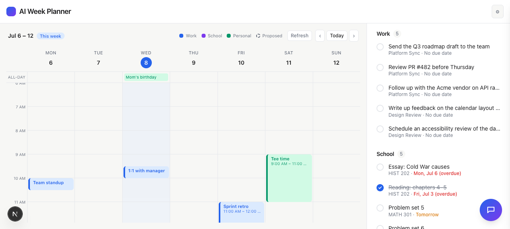

# Task 03 Proofs — Persistence (generate-once, never-regenerate) + Work list

## Task Summary

Adds the persistence layer that makes action-item generation stable and clearing
permanent: `lib/granola/store.ts` (processed meetings + open items) plus a
source-agnostic completions store, wired through `/api/granola/actions` and into the
Work list in `DashboardShell` (replacing the mock Work data).

## What This Task Proves

- **Generate once:** an already-processed meeting is not re-extracted on the next sync
  (the AI/extractor is not called again).
- **Never regenerate:** a cleared item id is excluded from the open list and does not
  reappear on a later sync.
- The Work list renders the persisted, AI-generated Granola action items (mock mode).
- A "Connect Granola" empty state shows when not connected.

## Evidence Summary

- `lib/granola/store.test.ts` proves generate-once (extractor called once across two
  syncs) and never-regenerate (cleared id absent after re-sync); full suite **137
  tests** green; lint + typecheck clean.
- Screenshot: Work list populated with 5 AI-generated action items across 2 meetings.

## Artifact: Store rules unit test

**What it proves:** The two core rules Jack asked for are enforced and covered.

**Why it matters:** "Cleared should always stay cleared" is the defining requirement of
this story.

**Command:** `npx vitest run lib/granola lib/todos`

**Result summary:** 9 tests pass. `store.test.ts`: after two `syncActions` calls the
injected extractor was called exactly once (generate-once); after clearing
`granola-m1-0` the re-sync returns only `granola-m1-1` (never-regenerate).

```
 Test Files  4 passed (4)
      Tests  9 passed (9)
```

## Artifact: Work list populated from Granola (demo mode)

**What it proves:** Real (demo) meeting transcripts become AI-generated Work action
items on screen, each labeled by source meeting with no due date.

**Artifact path:** `docs/specs/05-spec-granola-action-items/05-proofs/05-task-03-work-populated.png`

**Result summary:** Work shows 5 items — three from "Platform Sync", two from "Design
Review" — each "· No due date". School remains Canvas-driven; both integrations live.



## Reviewer Conclusion

Generation is stable and clearing is permanent (proven by test), and the Work list is
now driven by AI-generated Granola action items. Ready for the combined Completed
archive in Task 04.
