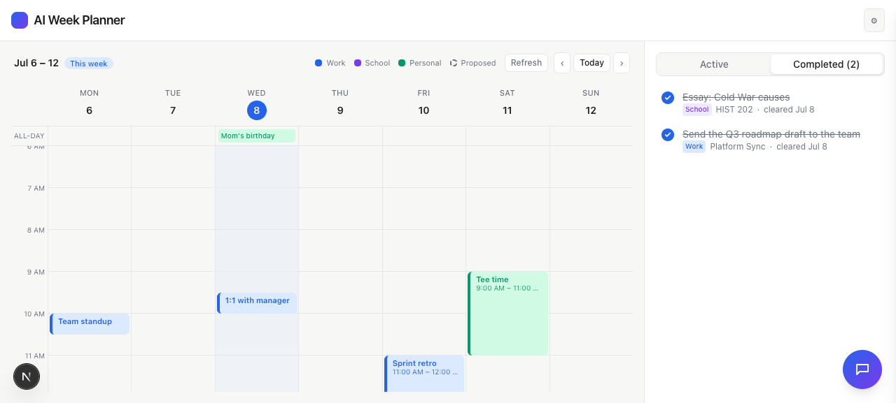
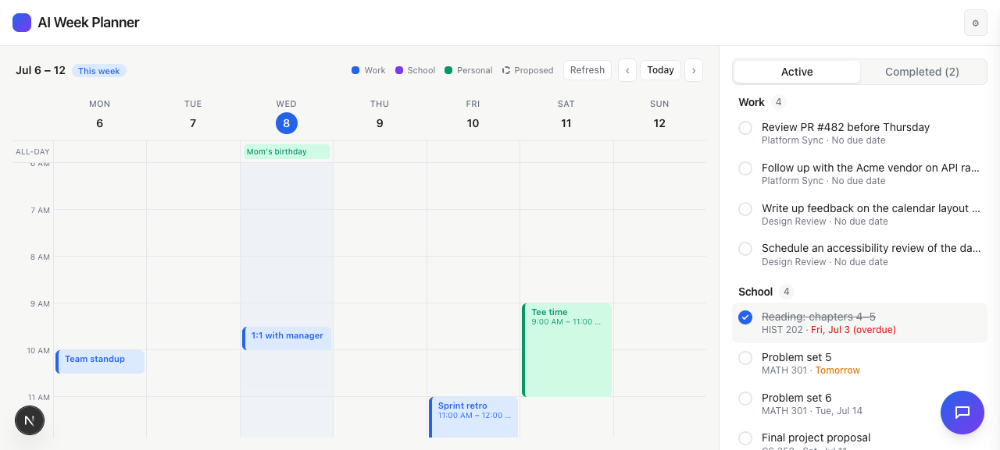

# Task 04 Proofs — Combined Active | Completed archive (Work + School)

## Task Summary

Adds the source-agnostic completions store, the clear→complete endpoints, a combined
`CompletedView`, and the `Active | Completed` toggle in `DashboardShell`. Clearing any
item (Work or School) removes it from the active list, persists it, and surfaces it in
one combined archive — most-recent-first, labeled by source, across reloads.

## What This Task Proves

- Clearing an item removes it from the Active list and persists it (POST).
- The combined Completed view lists cleared **Work and School** items, source-labeled,
  most-recent-first, with a cleared date.
- Active lists exclude completed ids; the archive persists across reloads.

## Evidence Summary

- `lib/todos/completions.test.ts` (append, most-recent-first, active-exclusion,
  idempotent) + `DashboardShell.completed.test.tsx` (clear → leaves Active → POST →
  appears under Completed) pass; full suite **141 tests** green; lint + typecheck clean.
- Screenshot: Completed view showing a cleared Work item and a cleared School item.
- Screenshot: Active view after clearing (the items are gone from Active).

## Artifact: Completions store + clear-flow tests

**Command:** `npx vitest run lib/todos components/DashboardShell.completed.test.tsx`

**Result summary:** The store sorts most-recent-first, excludes completed ids from an
active list, and is idempotent; the component test proves clicking a Work item removes
it from Active, sends `POST /api/todos/complete`, and shows it under the Completed tab.

## Artifact: Completed archive (Work + School)

**What it proves:** One persisted place to review everything cleared, across both
sections, labeled by source.

**Artifact path:** `docs/specs/05-spec-granola-action-items/05-proofs/05-task-04-completed-view.png`

**Result summary:** Under the **Completed (2)** tab: "Essay: Cold War causes"
(**School** · HIST 202 · cleared Jul 8) and "Send the Q3 roadmap draft to the team"
(**Work** · Platform Sync · cleared Jul 8), both struck through, most-recent-first.

## Artifact: Active view after clearing

**What it proves:** Cleared items leave the active list (inbox-zero).

**Artifact path:** `docs/specs/05-spec-granola-action-items/05-proofs/05-task-04-active-after-clear.png`

**Result summary:** After clearing the roadmap (Work) and essay (School) items, neither
appears in the Active Work/School lists.

## Reviewer Conclusion

Clearing is now a persistent move-to-archive across both sections, and the combined
Completed view lets Jack review everything he's checked off. Ready for the bounded
independent-scroll layout + planner integration in Task 05.
