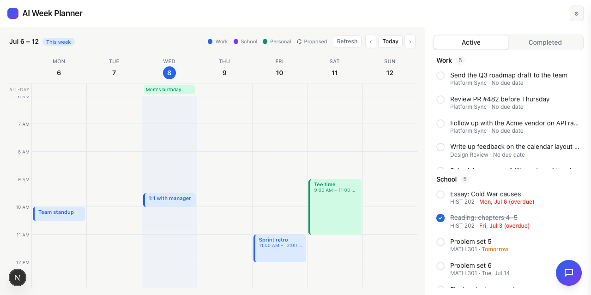

# Task 05 Proofs — Independent-scroll layout + planner integration

## Task Summary

Makes the right-column Work and School lists each bounded and independently
scrollable (neither can push the other off-screen), and confirms Granola-generated
Work action items flow into the planner so the AI can schedule them — without
regressing the planner's rules.

## What This Task Proves

- Work and School each occupy a bounded region and scroll independently; both stay
  visible even when one list is long.
- Granola Work items (no due date) reach the planner's `WeekState.todos` alongside
  School items, and serialize as "no due date" (not "undefined").
- Existing planner rule tests still pass (no regression).

## Evidence Summary

- `lib/planner/week.test.ts` proves Work + School todos reach `toWeekState` and undated
  Work items serialize cleanly; full suite **143 tests** green; lint + typecheck clean.
- Screenshot: dashboard (short viewport) — Work scrolls within its half while School
  remains fully visible below.

## Artifact: Planner week-state test

**What it proves:** Granola Work items are handed to the planner, so the AI can propose
time blocks for them; undated items serialize correctly.

**Command:** `npx vitest run lib/planner/week.test.ts`

**Result summary:** `toWeekState` includes both the `granola-*` Work item and the
`canvas-*` School item; `serializeWeek` renders "no due date" for the undated Work item
and never emits "undefined". The existing planner rule tests (never overlap immovable,
propose-on-request, approval) remain green in the full run.

## Artifact: Bounded independent-scroll layout

**What it proves:** A long Work list no longer pushes School off-screen — each section
is bounded and scrolls on its own.

**Why it matters:** This is the layout fix Jack asked for.

**Artifact path:** `docs/specs/05-spec-granola-action-items/05-proofs/05-task-05-layout.png`

**Result summary:** In a short viewport, the **Work** list fills the top half and scrolls
(its 5th item is clipped at the divider), while **School** stays fully visible in the
bottom half with its own scroll. Both section headers remain on screen.

## Reviewer Conclusion

The dashboard layout keeps both todo lists visible and independently scrollable, and the
planner receives Granola Work items with no rule regressions. Story 5 is functionally
complete.
