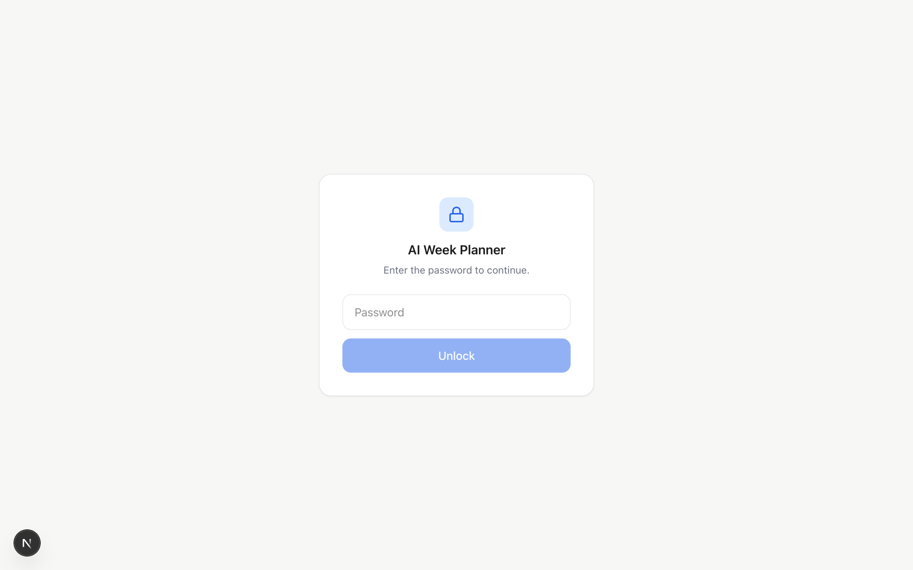
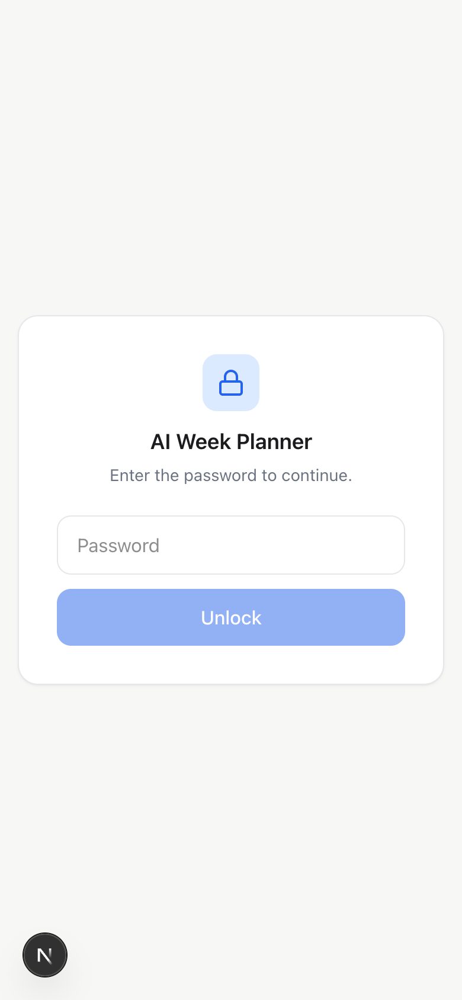
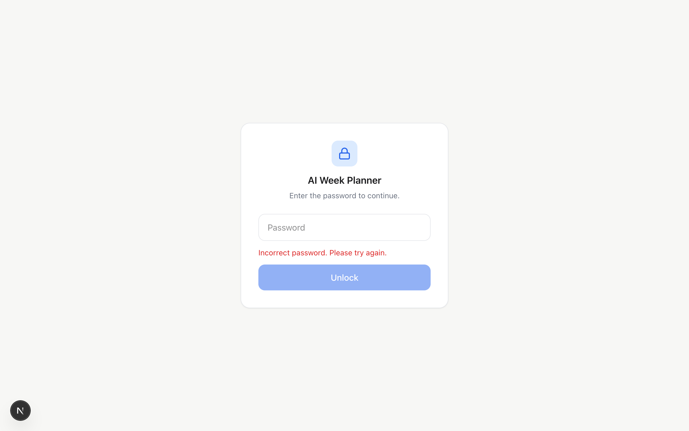

# Task 02 Proofs — In-app password protection (all pages + API routes)

## Task Summary

This task proves the app is protected by a single shared password covering **every page and
every API route**. A styled `/login` page posts the password to `/api/auth/login`, which — on a
correct password — sets a signed, HTTP-only session cookie. Root `middleware.ts` verifies that
cookie on every request: pages without it get a 307 redirect to `/login`, and API routes without
it get a **401** (so data routes are genuinely protected, not just visually hidden).

## What This Task Proves

- An unauthenticated **page** request is redirected to `/login` (with a `next` param).
- An unauthenticated **API** request returns **401**, not an HTML redirect.
- A wrong password is rejected (401); the correct password mints an HTTP-only cookie.
- With the cookie, both pages and API routes are reachable (200).
- The login page and its verify endpoint are never gated, so there is no redirect loop.
- The gate is enforced only when `APP_PASSWORD` is configured (production always sets it),
  avoiding a local-dev lockout.

## Evidence Summary

- `curl` against a locally-running build shows 307 (page), 401 (API), 401 (wrong password), and
  200 + `Set-Cookie: awp_session … HttpOnly` (correct password), then 200 on both surfaces with
  the cookie.
- Unit tests cover the session helper (sign/verify + constant-time password check) and the
  middleware (page-redirect vs API-401, valid cookie passes, login excluded, gate-disabled).
- Screenshots show the styled login page (desktop + mobile) and the inline error state.

## Artifact: End-to-end gate behavior via curl

**What it proves:** the middleware protects pages and API routes and the login flow issues a
working session cookie — observed against a running server, not just in unit tests.

**Why it matters:** this is the core security guarantee of the story. The API-returns-401 case
(vs a redirect) is the specific requirement that data isn't merely hidden.

**Commands & result summary:** server run with `APP_PASSWORD` + `SESSION_SECRET` set. Page `/`
→ 307 to `/login`; `POST /api/plan` → 401; wrong password → 401; correct password → 200 with an
`HttpOnly` cookie; authenticated page and API → 200.

```text
# PROOF 1: unauthenticated PAGE / →
status=307  location=http://localhost:3999/login?next=%2F

# PROOF 2: unauthenticated API POST /api/plan →
HTTP/1.1 401 Unauthorized
content-type: application/json

# PROOF 3: wrong password → /api/auth/login →
status=401

# PROOF 4: correct password → /api/auth/login →
HTTP/1.1 200 OK
set-cookie: awp_session=v1.2bd3090e…3673; Path=/; Max-Age=2592000; HttpOnly; SameSite=lax

# PROOF 5: authenticated PAGE / (with cookie) →
status=200
# PROOF 6: authenticated API /api/todos/completed (with cookie) →
status=200
```

## Artifact: Automated tests (session helper + middleware)

**What it proves:** the auth logic is covered by tests for both success and failure paths.

**Why it matters:** locks the access-control rule against future regressions.

**Command:**

```bash
npm run lint && npm run typecheck && npm test
```

**Result summary:** clean lint + typecheck; Vitest `Tests 170 passed (170)` — includes 8
`lib/auth/session.test.ts` and 7 `middleware.test.ts` cases (page redirect, API 401, valid cookie
passes, tampered cookie rejected, login route excluded, gate-disabled-when-unset).

## Artifact: Login page — desktop

**What it proves:** the gate has a polished, on-brand landing (not a raw browser popup).

**Artifact path:** `docs/specs/06-spec-vercel-deployment/06-proofs/06-task-02-login-desktop.png`

**Result summary:** centered card, lock glyph, work-blue accent, disabled Unlock until a password
is typed. (The small "N" is Next's dev-mode indicator, absent in production.)



## Artifact: Login page — mobile

**What it proves:** the gate is usable on a phone-width viewport.

**Artifact path:** `docs/specs/06-spec-vercel-deployment/06-proofs/06-task-02-login-mobile.png`

**Result summary:** the card fills a 390px-wide viewport with comfortable touch targets.



## Artifact: Wrong-password error state

**What it proves:** a rejected password shows a clear inline error and clears the field.

**Artifact path:** `docs/specs/06-spec-vercel-deployment/06-proofs/06-task-02-login-error.png`

**Result summary:** "Incorrect password. Please try again." in the danger color after a wrong
attempt.



## Reviewer Conclusion

The whole app is gated behind one shared password: pages redirect to a styled login, API routes
return 401, the correct password issues an HTTP-only session cookie that unlocks both surfaces,
and the behavior is covered by unit tests and demonstrated live with curl and screenshots.
