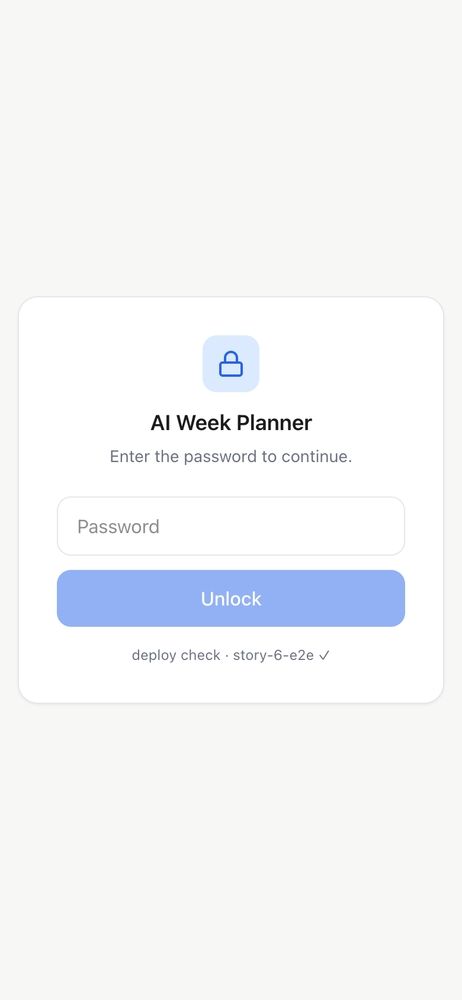
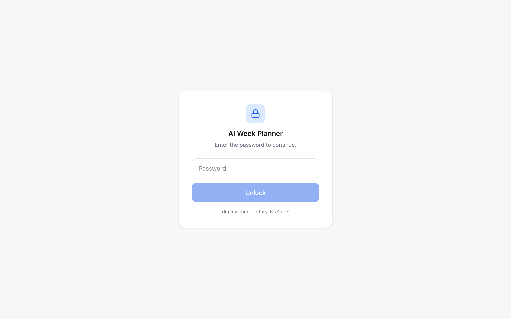

# Task 05 Proofs — End-to-end deploy proof + revert + mobile

## Task Summary

This task proves the whole pipeline works automatically: a change pushed to `main` passes the CI
quality gate and appears on the live Vercel URL with no manual deploy step, and the app is usable
on a phone. To keep the evidence free of personal data, the visible change was a small marker on
the **public login page**, which was then reverted so the app returns to normal.

## What This Task Proves

- A commit pushed to `main` triggers the CI quality gate **and** an automatic Vercel production
  deploy — no manual deploy step.
- The change is visible on the live URL shortly after push.
- Reverting with a follow-up commit auto-deploys and restores the app to normal.
- The deployed app is usable on a phone-width viewport.

## Evidence Summary

- Marker commit `fdf414b`: CI concluded **success**, and the marker appeared on the live login
  page in **~64s**.
- Revert commit `c8ab377`: auto-deployed and the marker was **gone in ~56s**; login page still
  returns 200.
- Live login page renders cleanly on desktop and mobile widths (screenshots below).
- The real dashboard was verified usable at 390px width (calendar, tabs, nav, chat bubble) — not
  committed here because it contains personal calendar data.

## Artifact: Push → CI green → auto-deploy (the marker appears live)

**What it proves:** pushing to `main` both passes CI and deploys to production automatically.

**Why it matters:** this is the core "it just deploys" guarantee of the story.

**Evidence:**

```text
# after: git push origin main   (commit fdf414b, adds the marker)
✓ marker LIVE after ~64s        # polled https://ai-week-planner-tau.vercel.app/login
CI: status=completed  conclusion=success  sha=fdf414b
```

## Artifact: Live login page with the marker (desktop + mobile)

**What it proves:** the deployed app served the new change, and renders well on both widths.

**Why it matters:** confirms the change reached real users' browsers, and doubles as the mobile
usability check for a core public page (no personal data).

**Artifact paths:**
`docs/specs/06-spec-vercel-deployment/06-proofs/06-task-05-live-login-desktop.png`,
`06-task-05-live-login-mobile.png`

**Result summary:** the live login card shows `deploy check · story-6-e2e ✓` under the Unlock
button, laid out cleanly on a 390px-wide phone viewport.





## Artifact: Revert restores the app (marker gone)

**What it proves:** the follow-up revert commit auto-deployed and returned the app to normal.

**Evidence:**

```text
# after: git push origin main   (commit c8ab377, reverts the marker)
✓ marker GONE after ~56s — app back to normal
login page status=200

git log --oneline:
c8ab377 revert: remove temporary deploy-check marker (Story 6 e2e proof complete)
fdf414b chore: add temporary deploy-check marker to login (Story 6 e2e proof)
```

## Artifact: Mobile usability of the real app

**What it proves:** the deployed dashboard (behind login) is usable on a phone.

**Why it matters:** the story requires the live app to work on a phone browser, not just the login
page.

**Result summary:** logged in at 390px width; the dashboard rendered the header + Calendar/Todos
tabs, the week navigator (Jul 6–12, Refresh, Today, prev/next), day columns with all-day and timed
Google events, the now-line, and the chat bubble — all responsive and scrollable. Screenshot kept
out of the repo because it contains real calendar data.

## Reviewer Conclusion

The deploy pipeline works end to end: a pushed change passes CI and auto-deploys to the live URL
in about a minute, a revert cleanly restores it, and the deployed app is usable on a phone.
