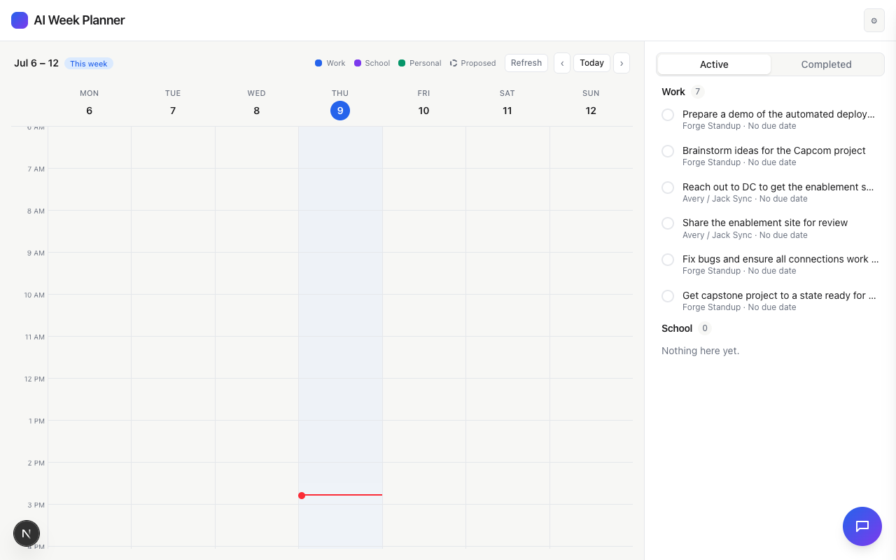
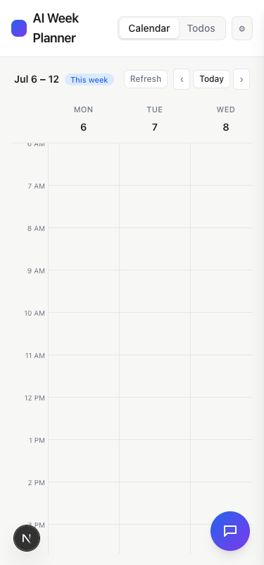
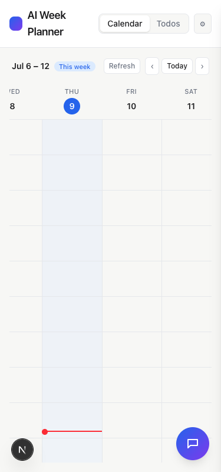

# Task 01 Proofs - Independent grid-body scroll region (now-line no longer bleeds)

## Task Summary

This task restructures the week calendar's scroll containers so the hourly
grid body (day columns + the current-time line inside them) scrolls
vertically in its own independent region, decoupled from the day-header and
all-day strip. Previously all three shared one scrolling context with the
header/strip pinned via `position: sticky`, and the line's higher z-index
let it paint over them whenever scroll position brought its row underneath
the pinned header/strip. Structural separation makes that overlap
impossible, regardless of z-index.

## What This Task Proves

- The now-line (`data-testid="now-line"`) is a DOM descendant of the new
  independently-scrolling grid body (`data-testid="grid-body"`), which is
  never an ancestor or descendant relationship with the header
  (`data-testid="day-header"`) — proving the two occupy structurally
  separate regions that cannot visually overlap.
- This holds at the exact scroll position (6:00 AM, the start of the default
  visible window) that would have triggered the bleed under the old
  implementation.
- No regression: all pre-existing `Calendar.test.tsx`, `NowLine.test.tsx`,
  and `accessibility.test.tsx` assertions pass unmodified.
- Visually confirmed live in the running app, on both a desktop (1280px) and
  mobile (375px) viewport, scrolled to the boundary position: the red line
  never overlaps the header or all-day strip.

## Evidence Summary

- `Calendar.test.tsx`: 9/9 tests pass, including the new structural
  containment case.
- `NowLine.test.tsx` and `accessibility.test.tsx`: pass unmodified.
- Full suite: 185/185 tests pass, lint and typecheck clean.
- Live manual check on both viewport sizes, scrolled to the boundary
  position: no overlap observed.

## Artifact: Structural containment test

**What it proves:** With "now" seeded at 6:00 AM (the start of the default
visible window — the exact scroll position that used to bleed), the
now-line is contained inside the grid body, and the grid body and header
have no ancestor/descendant relationship in the DOM.

**Why it matters:** This is a direct, automated regression guard for the
exact bug reported — not just a visual spot-check that could regress
silently later.

**Command:**

```bash
npx vitest run components/Calendar/Calendar.test.tsx
```

**Result summary:** All 9 tests pass, including
`"confines the now-line inside the grid body, structurally separate from the header/strip"`.

```
 RUN  v4.1.10 /Users/jack/ai-week-planner

 Test Files  1 passed (1)
      Tests  9 passed (9)
```

## Artifact: No regression in NowLine or accessibility suites

**What it proves:** The restructuring didn't break the now-line's own time
computation (from Spec 07) or any accessibility assertions about the
calendar's structure.

**Command:**

```bash
npx vitest run components/Calendar/NowLine.test.tsx components/accessibility.test.tsx
```

**Result summary:** Both suites pass unmodified.

```
 Test Files  2 passed (2)
      Tests  4 passed (4)
```

## Artifact: Live visual check — desktop, initial view

**What it proves:** At the actual current time, the calendar renders
normally with the header, all-day area boundary, and grid all visible, red
line correctly positioned well inside the grid.

**Artifact path:** `docs/specs/08-spec-nowline-header-bleed-fix/08-proofs/desktop-initial.png`

**Result summary:** Clean render at 1280×800 — no overlap.


## Artifact: Live visual check — desktop, scrolled to the grid's top boundary

**What it proves:** With the grid body's independent scroll region
programmatically scrolled to `scrollTop = 0` (showing the earliest visible
hour, right at the header/grid boundary — the exact position that used to
bleed), the red line still renders well within the grid, with a clean
boundary line separating it from the header above.

**Why it matters:** This is the specific scroll position the original bug
was reported at.

**Artifact path:** `docs/specs/08-spec-nowline-header-bleed-fix/08-proofs/desktop-scrolled-top.png`

**Result summary:** No overlap — the "6 AM" row sits directly under a clean
horizontal divider below the header, with the red line several rows further
down, fully inside the grid.



## Artifact: Live visual check — mobile (375px), initial view

**What it proves:** The same clean header/grid separation holds at a narrow
mobile viewport width.

**Artifact path:** `docs/specs/08-spec-nowline-header-bleed-fix/08-proofs/mobile-initial.png`

**Result summary:** Clean render at 375×800 (showing Mon–Wed before
horizontal scroll to today's column).



## Artifact: Live visual check — mobile (375px), scrolled to today's column at the top boundary

**What it proves:** With the grid scrolled horizontally to bring today's
column into view and vertically to the same top-boundary position as the
desktop check, the red now-line remains fully confined to the grid, with no
overlap into the header row above.

**Artifact path:** `docs/specs/08-spec-nowline-header-bleed-fix/08-proofs/mobile-scrolled-today.png`

**Result summary:** No overlap — the header row (WED/THU/FRI/SAT) is
cleanly separated from the grid, and the red line sits well below it, fully
inside today's (Thursday's) highlighted column.



## Reviewer Conclusion

The now-line is structurally confined to the grid body's own independent
scroll region on both desktop and mobile, at the exact scroll position that
previously caused the header-bleed bug. This is backed by both an automated
DOM-structure regression test and direct visual confirmation in the running
app, with zero regressions to the existing Calendar/NowLine/accessibility
test suites.
