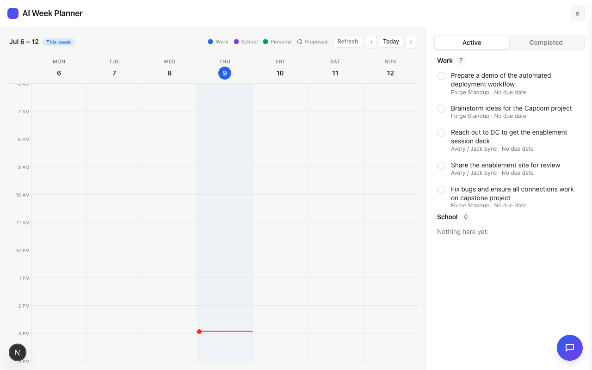
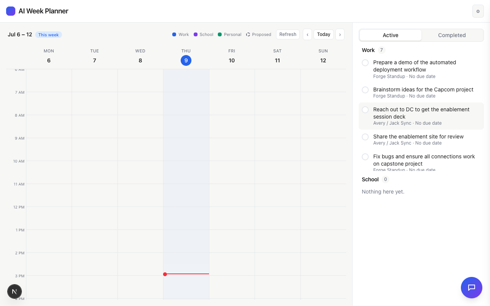

# Task 01 Proofs - Two-line clamp with click-to-expand

## Task Summary

This task replaces the todo title's single-line `truncate` ellipsis with a
2-line clamp (`line-clamp-2`), and makes the title itself clickable to
toggle full expansion — so a long title's full text is always reachable,
either by default (fits in 2 lines) or after one click.

## What This Task Proves

- Long todo titles that used to be permanently cut off with "…" now wrap
  onto 2 lines by default.
- Clicking a title toggles it between the 2-line clamp and fully expanded,
  reflected in `aria-expanded`.
- Clicking the title does not affect the done checkbox — the two
  interactions are independent.
- The checkbox stays visually aligned regardless of how many lines the
  title occupies.
- No regression to existing checkbox-toggle, due-date-emphasis, or
  meta-label behavior.

## Evidence Summary

- `TodoItem.test.tsx` (new): 4/4 tests pass.
- `TodoSection.test.tsx` (existing): 6/6 tests pass unmodified.
- Full suite: 189/189 tests pass (up from 185), lint and typecheck clean.
- Live check in the running app (mock data, real titles from the seeded
  todo list) confirms titles that used to be truncated with "…" now wrap
  fully, and clicking a title toggles its expanded state without touching
  the checkbox.

## Artifact: Clamp/expand toggle unit tests

**What it proves:** A long title defaults to the 2-line clamp with
`aria-expanded="false"`, clicking it removes the clamp and sets
`aria-expanded="true"`, clicking again reverts it — and none of this
affects the `onToggle` (done) callback.

**Why it matters:** This is the core new behavior the task adds, covered by
an automated regression test rather than only a manual check.

**Command:**

```bash
npx vitest run components/TodoSection/TodoItem.test.tsx
```

**Result summary:** All 4 tests pass.

```
 RUN  v4.1.10 /Users/jack/ai-week-planner

 Test Files  1 passed (1)
      Tests  4 passed (4)
```

## Artifact: No regression to existing TodoSection behavior

**What it proves:** Checkbox toggling, due-date emphasis/classification,
and meta-label rendering are all unaffected by the title change.

**Command:**

```bash
npx vitest run components/TodoSection/TodoSection.test.tsx
```

**Result summary:** All 6 pre-existing tests pass unmodified.

```
 RUN  v4.1.10 /Users/jack/ai-week-planner

 Test Files  1 passed (1)
      Tests  6 passed (6)
```

## Artifact: Live view — long titles now wrap instead of truncating

**What it proves:** Titles from the app's real (mock) data that previously
would have shown "Prepare a demo of the automated deploy…" now wrap onto 2
full lines, fully readable, with the checkbox correctly aligned to the top
of each (now potentially 2-line) row.

**Artifact path:** `docs/specs/09-spec-todo-title-wrap/09-proofs/todo-titles-wrapped.png`

**Result summary:** Every previously-truncated title ("Prepare a demo of the
automated deployment workflow", "Reach out to DC to get the enablement
session deck", "Fix bugs and ensure all connections work on capstone
project") is now fully visible across 2 lines, with clean checkbox
alignment.



## Artifact: Live check — clicking a title toggles expand state without affecting the checkbox

**What it proves:** Clicking "Reach out to DC to get the enablement session
deck" set that title's `aria-expanded` to `"true"` while its checkbox's
`aria-checked` remained `"false"` — confirming the two interactions are
independent, matching the automated test.

**Command:**

```bash
# after clicking the title via agent-browser:
document.querySelector('[aria-label*="Reach out to DC"]').getAttribute('aria-checked')
```

**Result summary:** `aria-expanded` on the title became `"true"`;
`aria-checked` on the checkbox stayed `"false"`.

**Artifact path:** `docs/specs/09-spec-todo-title-wrap/09-proofs/todo-after-expand-click.png`



## Reviewer Conclusion

Long todo titles are no longer permanently unreadable — they wrap to 2
lines by default and expand fully on click, verified both by an automated
DOM-state test and by live interaction against the app's real seeded data,
with zero regressions to existing todo behavior.
