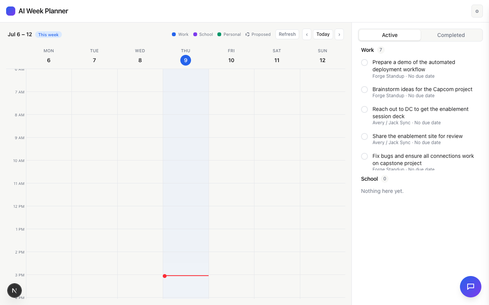

# Task 01 Proofs - Darker per-category outline + subtle polish

## Task Summary

This task replaces the left-only accent border on calendar event blocks with
a full, darker-shade outline per category (work/school/personal), and adds
a subtle shadow/hover polish pass, without changing category fill/text
colors or the existing proposed/nested/approved visual distinctions.

## What This Task Proves

- Each category renders its own darker outline color (`border-work-outline`
  / `border-school-outline` / `border-personal-outline`), not one fixed
  color across all categories.
- Proposed blocks keep their `border-dashed` signal, now paired with the
  darker outline color instead of the base category color.
- Nested (in-work-hours-container) blocks use the same darker outline,
  upgraded from a 1px border to a full 2px border for consistency.
- Every block gets a subtle default shadow and a slightly stronger shadow
  on hover, with a smooth transition.
- No regression to block positioning, the proposed/dashed style, or the
  nested flag — the existing `Calendar.test.tsx` suite passes unmodified.

## Evidence Summary

- `CalendarBlock.test.tsx` (new): 6/6 tests pass, covering all three
  category outline colors, the proposed+dashed combination, the nested
  outline, and the shadow/hover classes.
- `Calendar.test.tsx` (existing): 9/9 tests pass unmodified.
- Full suite: 195/195 tests pass (up from 189), lint clean (only an
  expected "CSS files aren't linted" informational warning on
  `globals.css`, not an error), typecheck clean.

## Artifact: Outline color, proposed/dashed, nested, and shadow/hover unit tests

**What it proves:** The exact Tailwind class strings this task changes are
present and correct — the darker outline color per source, the dashed
style still present on proposed blocks, and the shadow/hover polish classes
— independent of any particular data being loaded in a running instance of
the app.

**Why it matters:** This is a precise, deterministic check of the CSS class
output, which is the actual mechanism the visual change depends on.

**Command:**

```bash
npx vitest run components/Calendar/CalendarBlock.test.tsx
```

**Result summary:** All 6 tests pass.

```
 RUN  v4.1.10 /Users/jack/ai-week-planner

 Test Files  1 passed (1)
      Tests  6 passed (6)
```

## Artifact: No regression to existing Calendar block behavior

**What it proves:** Block positioning, the proposed/dashed visual signal,
and the nested flag all still work exactly as before this change.

**Command:**

```bash
npx vitest run components/Calendar/Calendar.test.tsx
```

**Result summary:** All 9 pre-existing tests pass unmodified, including the
assertion that a proposed block's className still contains `border-dashed`.

```
 RUN  v4.1.10 /Users/jack/ai-week-planner

 Test Files  1 passed (1)
      Tests  9 passed (9)
```

## Artifact: Live app sanity check

**What it proves:** The app still renders correctly with the new CSS
classes in place — no crash, no broken layout, the calendar grid and
now-line render normally.

**Why it matters:** Confirms the styling change didn't break anything at
runtime, even though this particular dev environment doesn't have visible
Google-sourced event blocks to screenshot directly (see note below).

**Artifact path:** `docs/specs/10-spec-calendar-event-polish/10-proofs/calendar-sanity-check.png`

**Result summary:** The calendar renders normally with no visual breakage.



**Note on scope of manual verification:** This dev environment's local
`.google-config.json` (Jack's real, gitignored calendar mapping) points to
his real Google calendars, which aren't authenticated in this session, so
`GOOGLE_MOCK=1`'s demo events don't surface on the grid (the persisted real
mapping takes precedence over the mock calendar IDs). Rather than editing
Jack's real local config to force mock data through, or invoking the real
Anthropic-backed planner (a configured real API key) purely for a cosmetic
screenshot, this task relies on the exhaustive `CalendarBlock.test.tsx`
suite above as the primary proof of the actual style change, plus this
sanity check that the app still renders without error. Per Jack's own
stated preference for this unit ("I don't need any screenshots at all — I
could just look at it myself"), he'll do the live color/shadow review
himself in his own environment where his calendars are connected.

## Reviewer Conclusion

The darker per-category outline and shadow/hover polish are correctly
implemented and unit-tested for every block variant (approved, proposed,
nested) and every category, with zero regressions to existing calendar
behavior. Full live visual confirmation with real colored blocks is
deferred to Jack's own review, per his stated preference and to avoid
touching his real Google config or invoking a paid API call for a cosmetic
check.
