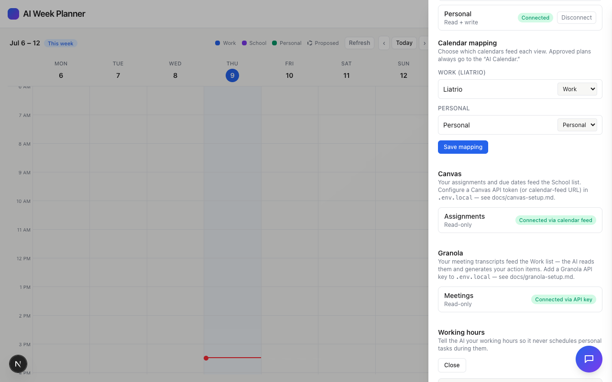
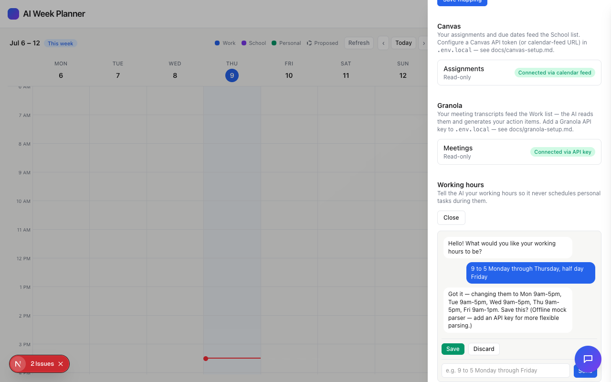
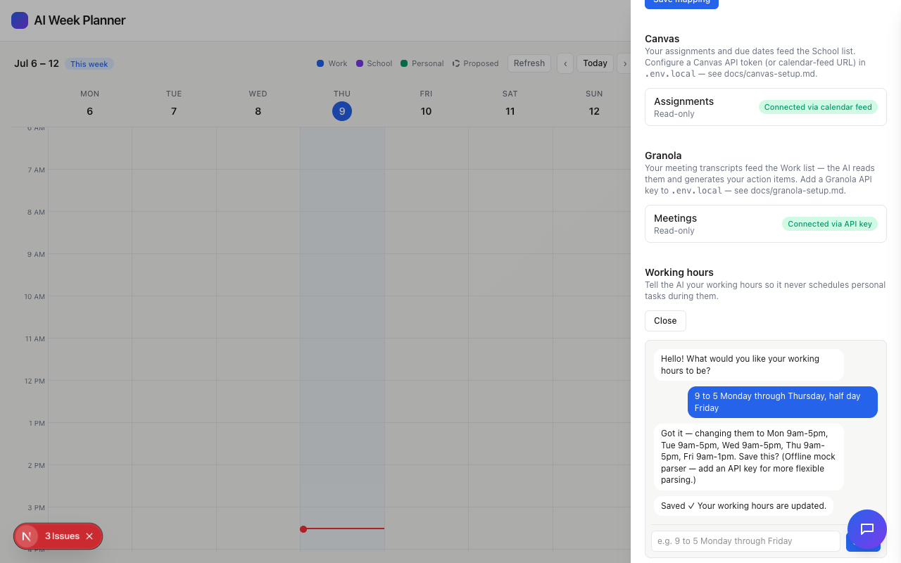
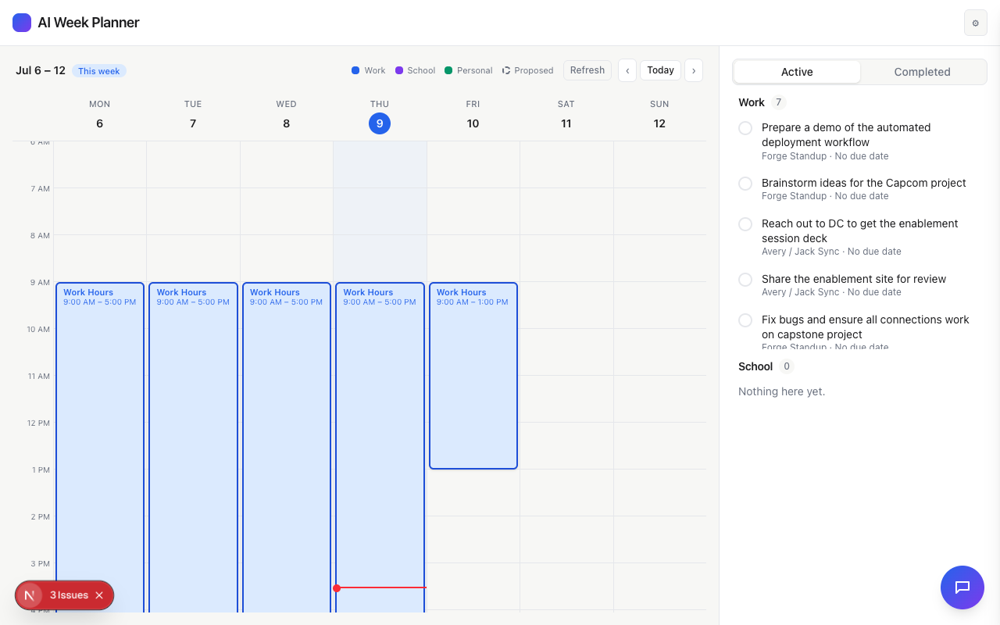

# Task 04 Proofs - Settings entry point: inline work-hours chat with confirm-before-save

## Task Summary

This task adds the "Change work hours" entry point Jack actually uses: a
small chat panel inline in the Settings drawer, scoped only to
understanding and confirming working hours (never planning the week or
creating events), that references current hours when reopened and requires
an explicit Save/Discard confirmation before persisting anything.

## What This Task Proves

- `GET`/`POST /api/work-hours` correctly read/write the persisted rule.
- Opening the panel greets differently depending on whether a rule is
  already set — generic question vs. referencing current hours.
- After parsing, a summary is shown with Save/Discard actions; Save
  persists, Discard doesn't.
- The full real flow — Settings → describe hours → parsed summary → Save →
  the resulting immovable block appears on the calendar — works
  end-to-end in the actual running app, including the half-day override.

## Evidence Summary

- `app/api/work-hours/route.test.ts`: 3/3 tests pass.
- `components/Settings/WorkHoursChat.test.tsx`: 4/4 tests pass.
- Existing `DashboardShell*.test.tsx` suites: 8/8 pass unmodified (the new
  panel is never mounted in those tests since none of them open Settings).
- Full suite: 226/226 tests pass (up from 219), lint and typecheck clean.
- Live end-to-end verification in the running app (mock Google mode, real
  Anthropic key deliberately overridden to empty for this check so the
  deterministic mock parser was exercised instead of a paid API call):
  described hours in plain language, confirmed the parsed summary, saved,
  and watched the immovable "Work Hours" block (including the half-day
  Friday) appear on the calendar for the current week.

## Artifact: Get/set rule route

**What it proves:** `GET /api/work-hours` returns the persisted rule (or an
empty default), and `POST` persists a new one, using an isolated temp file
so Jack's real local `.google-config.json`/`.work-hours.json` are never
touched by the test run.

**Command:**

```bash
npx vitest run app/api/work-hours/route.test.ts
```

**Result summary:** All 3 tests pass.

```
 RUN  v4.1.10 /Users/jack/ai-week-planner

 Test Files  1 passed (1)
      Tests  3 passed (3)
```

## Artifact: WorkHoursChat component — opening message, confirm, save/discard

**What it proves:** The two opening-message variants (generic vs.
referencing current hours), the summary+Save/Discard flow after a parsed
reply, and that only Save calls the persistence endpoint.

**Command:**

```bash
npx vitest run components/Settings/WorkHoursChat.test.tsx
```

**Result summary:** All 4 tests pass, including the explicit assertion
that Discard never calls `/api/work-hours`.

```
 RUN  v4.1.10 /Users/jack/ai-week-planner

 Test Files  1 passed (1)
      Tests  4 passed (4)
```

## Artifact: Live end-to-end flow in the running app

**What it proves:** The complete real user flow works: opening Settings,
clicking "Change work hours", describing hours in plain language, seeing a
correct plain-language summary (including a correctly-computed half day),
confirming Save, and seeing the resulting immovable blocks render on the
calendar for the current week — with the Unit 2 (no header bleed) and Unit
4 (darker outline) work from earlier in this run visibly holding up
together with this new feature.

**Why it matters:** This is the actual feature Jack will use, verified
against the real running app rather than only unit tests.

**Step 1 — opening the panel (references no rule set yet):**

**Artifact path:** `docs/specs/11-spec-configurable-work-hours/11-proofs/wh-01-opened.png`



**Step 2 — after describing hours, showing the parsed summary and confirm actions:**

**Artifact path:** `docs/specs/11-spec-configurable-work-hours/11-proofs/wh-02-confirm.png`

**Result summary:** The message "9 to 5 Monday through Thursday, half day
Friday" was parsed to "Mon 9am-5pm, Tue 9am-5pm, Wed 9am-5pm, Thu 9am-5pm,
Fri 9am-1pm" with Save/Discard buttons shown — the half-day computation is
correct (half of the 8-hour main range applied to Friday only).



**Step 3 — after clicking Save:**

**Artifact path:** `docs/specs/11-spec-configurable-work-hours/11-proofs/wh-03-saved.png`

**Result summary:** A "Saved ✓ Your working hours are updated." confirmation
appears, and the rule was verified persisted to the local
`.work-hours.json` file (gitignored, not committed).



**Step 4 — the resulting immovable blocks on the calendar:**

**Artifact path:** `docs/specs/11-spec-configurable-work-hours/11-proofs/wh-04-calendar.png`

**Result summary:** "Work Hours" blocks render Mon-Thu 9:00 AM-5:00 PM and
Fri 9:00 AM-1:00 PM, with no block on Sat/Sun — exactly matching the
confirmed rule. The now-line stays correctly confined to the grid (Unit 2)
and the blocks show the darker per-category outline (Unit 4), confirming
this feature composes correctly with the rest of this run's work.



## Artifact: Full quality gate

**Command:**

```bash
npm test && npm run lint && npx tsc --noEmit
```

**Result summary:** 226/226 tests pass across 51 files; lint and typecheck
clean.

```
 Test Files  51 passed (51)
      Tests  226 passed (226)
```

## Reviewer Conclusion

The Settings entry point is fully implemented and verified both by
automated tests and a real end-to-end run in the live app: Jack can
describe his working hours in plain language, confirm a correct summary
(including half-day handling), save, and immediately see the immovable
block on his calendar — completing the full feature described in Spec 11.
